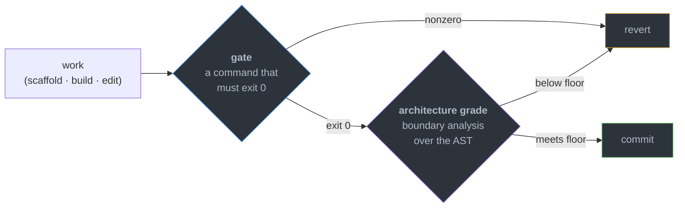
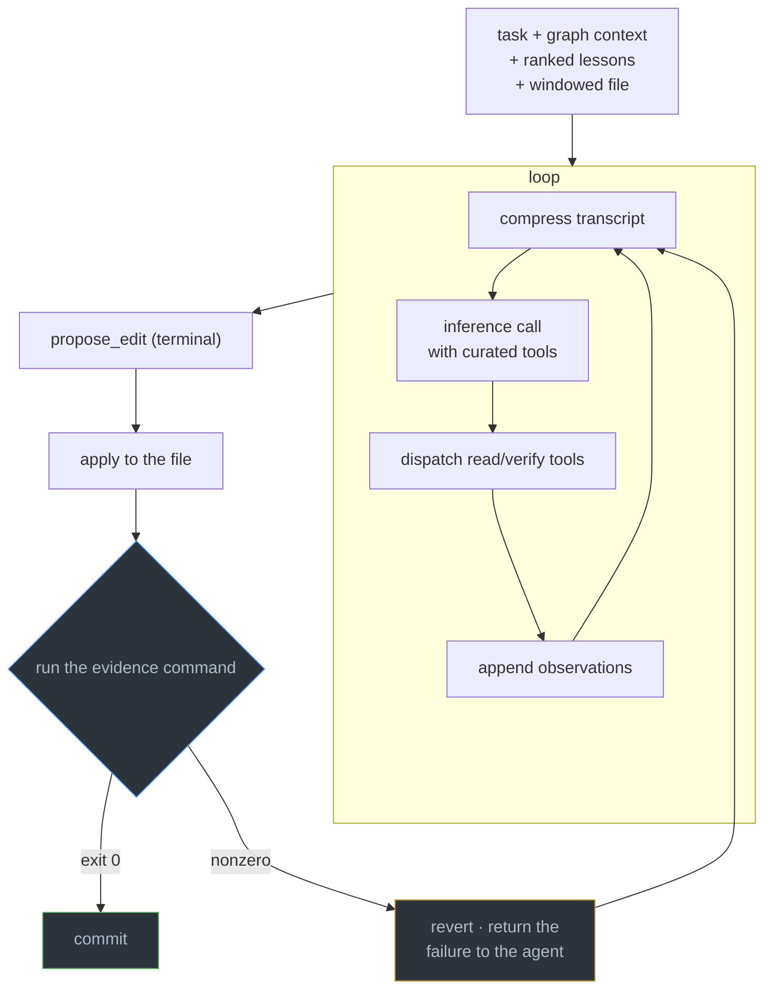
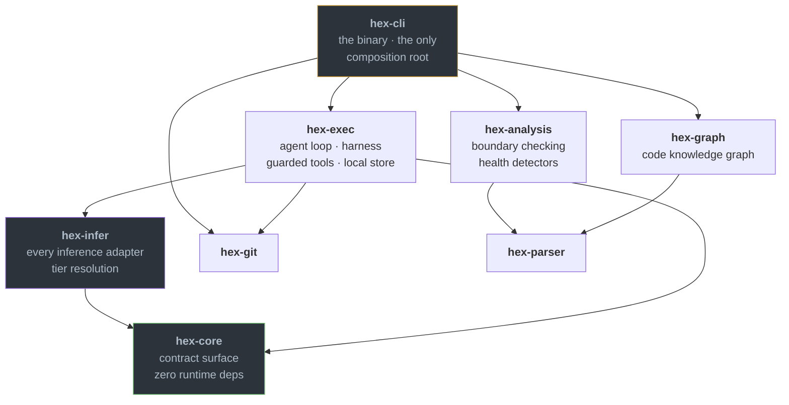

# hex Architecture

The living map. It always describes HEAD. Decisions and their reasoning live in the
append-only [ADR ledger](docs/adrs/INDEX.md); if this file and an older document
disagree, this file wins, and the contradiction is worth an ADR.

## What hex is

One binary that scaffolds hexagonal projects and keeps checking them. There is no
daemon, no database, and no background process. Every verb runs in-process and exits.

Two gates decide whether generated work counts:



The first answers *does it run*. The second answers *is it the shape you asked
for*. A test suite cannot reach that second question. A program whose use case
imports a database driver passes its tests.

## The execution model

A single ReAct loop, in process. The differentiator is the quality of context
assembled for one loop, not the number of loops.



- **Loop and tool protocol.** `hex-exec/src/direct_react.rs` holds the ReAct loop.
  `simple_agent.rs` holds native function-calling with a text-mode JSON fallback.
  `direct_exec.rs` holds the single-shot path.
- **Curated, guarded tools.** They live in `hex-exec/src/tools/`. Read and verify tools only
  (`repo_read`, `repo_grep`, `cargo_check`, `typescript_check`, `dep_audit`,
  `secret_scan`) plus the terminal `propose_edit`. No arbitrary shell. Tools reject
  path traversal, block critical paths, and cap output.
- **Code-graph context.** `gather_context` reads `graph-out/graph.json` and calls
  `hex_graph::context::context_for(file)` and `rank_lessons`.
- **The gate is the sole authority on what commits.** A pass that exercised nothing
  is rejected as vacuous. A failed edit reverts atomically, so the next attempt
  matches against the original file rather than a half-applied one.
- **Per-run worktree isolation.** Autonomous runs execute in a `hex/auto/<id>`
  worktree off the operator's branch, hard-guarded against committing to the
  operator's tree. Interactive `hex do` commits on the current branch.
- **Best-of-N across complementary models.** A run walks the ordered candidate list
  in `.hex/project.json → inference.react_models` and commits the first candidate
  whose edit passes the gate. The gate picks the winner, not a classifier, so a
  mis-route costs latency and nothing else.
- **Frontier delegation.** A `claude-code` candidate hands the whole task to the
  operator's logged-in `claude` CLI, inside the same worktree, gate and commit. No
  API key, no VRAM ceiling.

## The build harness

The loop above handles *bounded* work: one file, one gate. Whole systems use
in-process fan-out of inference calls:

- **`hex scaffold '<what>' --target <dir> --lang <l> --grade A`.** Write the
  deterministic floor, prove its gate on this machine, then build the description
  onto it. Gated on the build **and** the grade.
- **`hex build '<challenge>' --target <dir> --gate '<cmd>'`.** Propose N divergent
  designs, red-team each, synthesize one spec, build until the gate passes. The spec
  is a disposable intermediate.
- **`hex harden <path> --gate '<cmd>'`.** Hunt for bugs by failure-class lens,
  verify each finding skeptically (default-refute), fix the confirmed ones under the
  gate.
- `hex build --harden` chains the last two.

What keeps it disciplined: the gate is the only authority, and the verifier defaults
to *refuting*, so plausible-but-wrong findings die before any edit is made.

## Workspace crates

Eight crates, one binary. The dependency direction is the architecture:



| Crate | Role |
|---|---|
| **hex-core** | The contract surface: the inference port and its mock, message/tool/validation types, value types. **Zero runtime dependencies**. Nothing below can bleed a runtime concern upward. |
| **hex-infer** | Every inference adapter (Ollama, OpenAI-compatible, Anthropic, frontier CLI), the endpoint registry, tier resolution, and the local provider's identity. **No file outside this crate names a provider or a model.** |
| **hex-exec** | The agent loop, per-run worktree isolation, the adversarial harness, transcript compression, the guarded tool library, the file-backed local store. |
| **hex-analysis** | Tree-sitter boundary checking, the layer classifier, dead-export and cycle detection, rule conformance, the architecture fingerprint, six health detectors. Powers `hex analyze`. |
| **hex-graph** | The code knowledge graph: `context_for`, `rank_lessons`, community detection. Builds and reads `graph-out/graph.json`. |
| **hex-git** · **hex-parser** | Git plumbing over libgit2 · parsing utilities. |
| **hex-cli** | The binary, and the only composition root. The one place adapters are wired together. |

## State

All of it is files on disk.

| What | Where |
|---|---|
| Lessons, gaps, decisions | `~/.hex/memory.jsonl` (`hex memory`) |
| Agent run feed | `~/.hex/runs.jsonl` (`hex do runs`) |
| Token spend | `~/.hex/spend.jsonl` |
| Registered inference backends | `~/.hex/inference-servers.json` (`hex config inference`) |
| Code knowledge graph | `graph-out/graph.json` (`hex graph build`) |
| ADRs, specs, workplans | `docs/` |
| Project config and rules | `.hex/project.json`, `.hex/ADR-rules.toml` |

Files rather than a database because every reader is a short-lived process on one
machine. A cache in front of a file that only a short-lived process reads is not a
cache. It is a second source of truth that can disagree with the first.

## Tiered inference routing

A task's tier selects a model from `.hex/project.json → inference.tier_models`.

| Tier | Use case |
|------|----------|
| T1 | scaffold / transform / script / classification |
| T2 | standard codegen |
| T2.5 | complex reasoning |
| T3 | frontier work |

The do-loop selects separately via `inference.react_models`. Choose both empirically
with **`hex bench agentic`**. It runs fixtures through the *real* loop in an
isolated worktree and scores per-model pass rates (corpus in
`docs/benchmarks/`). External coding-leaderboard rank does not predict agentic-loop
performance: measured here, the top-leaderboard local model scored last on the grid.

## Hexagonal rules, enforced

`hex analyze` walks the AST and checks these. hex obeys them itself: **A+ / 100 /
0 boundary violations**.

| # | Rule |
|---|---|
| 1 | `domain/` imports only `domain/` |
| 2 | `ports/` imports `domain/` only |
| 3 | `usecases/` imports `domain/` + `ports/` only |
| 4 | adapters import `ports/` **only**, never the domain directly |
| 5 | adapters never import other adapters |
| 6 | the composition root is the only file that imports an adapter |
| 7 | relative imports in scaffolded TypeScript use `.js` extensions (NodeNext) |

Rule 4 is the one implementations break. An adapter needing a domain type gets it
because the **port re-exports it**. Each adapter then has exactly one edge into
the core.

**Known gap:** the analyzer checks layer-to-layer edges and does not check
third-party imports, so a project can pull a runtime into `domain/` and still score
A+. Rule 1 is stricter than what is enforced. See
[`docs/analysis/2609120100-real-io-proof.md`](docs/analysis/2609120100-real-io-proof.md).

## Governance

- **ADRs are append-only.** A changed decision gets a new ADR that supersedes the
  old one. Nothing is edited or deleted. Lifecycle `Proposed → Accepted → Completed`,
  or `Rejected | Abandoned | Superseded | Deprecated`, changed only through
  `hex adr accept|complete|supersede`.
- **Epochs** group ADRs by design era, so an old decision can be read in the context
  it was made. `hex adr reindex` regenerates the [INDEX](docs/adrs/INDEX.md).
- **`founding-goals.md` is the one artifact agents may not author or amend.** Editing
  it requires a human commit under CODEOWNERS; retiring a goal additionally requires
  a Retirement-ADR explaining why it no longer serves the project.

## Build & test

```bash
cargo build -p hex-cli --release
cargo test --workspace
hex analyze .
hex ci --standalone-gate
```
