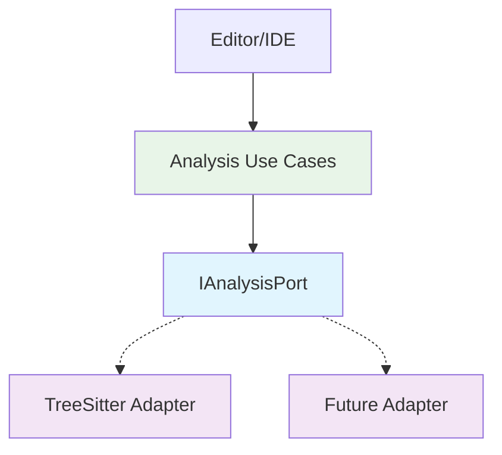

# Analysis Engine

The Analysis Engine provides semantic analysis capabilities for TypeScript/JavaScript codebases, enabling features like symbol lookup, type inference, and dependency mapping. This component implements the `IAnalysisPort` interface, allowing multiple analysis backends (currently TreeSitter) to be swapped interchangeably.

**ADR**: [docs/adrs/ADR-002-analysis-engine.md](./docs/adrs/ADR-002-analysis-engine.md)

**Layers**: Ports + Adapters (Tier 2)

## Architecture



The Analysis Engine implements the `IAnalysisPort` interface, providing semantic analysis services to use cases. Currently, it includes a TreeSitter-based adapter for parsing and analysis. The architecture follows hex principles with clear separation between the port contract and adapter implementations.

## Quick Start

### Prerequisites
- Node.js 18+
- TypeScript 5.0+
- Python 3.8+ (for TreeSitter bindings)

### Installation
```bash
npm install
# Install TreeSitter language parsers
npm run install-parsers
```

### Running
```bash
# Development mode
npm run dev

# Production
npm run build
npm start
```

### Testing
```bash
# Run all tests
npm test

# Run with coverage
npm run test:coverage

# Watch mode
npm run test:watch
```

## API Reference

### IAnalysisPort Interface

Located in `ports/IAnalysisPort.ts`, this interface defines the contract for analysis services.

```typescript
export interface IAnalysisPort {
  /**
   * Analyzes a TypeScript/JavaScript project and returns semantic information.
   * @param projectPath - Path to the project directory
   * @returns AnalysisResult containing symbols, types, and dependencies
   * @throws AnalysisError if analysis fails
   */
  analyzeProject(projectPath: string): Promise<AnalysisResult>;

  /**
   * Finds all references to a symbol within a project.
   * @param projectPath - Path to the project directory
   * @param symbolName - Name of the symbol to find
   * @returns ReferenceInfo containing locations and usage details
   */
  findReferences(projectPath: string, symbolName: string): Promise<ReferenceInfo[]>;

  /**
   * Gets type information for a specific symbol.
   * @param projectPath - Path to the project directory
   * @param symbolName - Name of the symbol
   * @returns TypeInfo containing type details and relationships
   */
  getTypeInfo(projectPath: string, symbolName: string): Promise<TypeInfo>;
}
```

### AnalysisResult Type

```typescript
export interface AnalysisResult {
  symbols: SymbolInfo[];
  types: TypeInfo[];
  dependencies: DependencyGraph;
  diagnostics: Diagnostic[];
}
```

### Usage Example

```typescript
import { AnalysisEngine } from './adapters/secondary/AnalysisEngine';
import { IAnalysisPort } from '../ports/IAnalysisPort';

async function main() {
  const engine: IAnalysisPort = new AnalysisEngine();
  
  try {
    const result = await engine.analyzeProject('/path/to/project');
    console.log(`Found ${result.symbols.length} symbols`);
  } catch (error) {
    console.error('Analysis failed:', error);
  }
}

main();
```

## Development Guide

### Adding New Adapters

1. Create a new adapter class implementing `IAnalysisPort`
2. Place it in `adapters/secondary/`
3. Export it from the adapters barrel file
4. Add it to the engine factory in `adapters/secondary/AnalysisEngineFactory.ts`

### Testing Conventions

- Use Jest with TypeScript support
- Follow London-school testing (focused on behavior)
- Mock dependencies using `jest.mock()`
- Test both success and error scenarios
- Use descriptive test names that read like specifications

### Hex Boundary Rules

- Adapters can only depend on ports, never on use cases
- Use cases can depend on ports and other use cases
- No circular dependencies between layers
- Keep domain logic in use cases, not in adapters

### Architecture Validation

```bash
# Check for architecture violations
npx hex analyze

# Check imports (no usecase -> adapter imports)
npx hex check-imports
```

### Common Pitfalls

- **Don't** put business logic in adapters
- **Don't** import use cases from adapters
- **Do** handle errors gracefully and return meaningful error types
- **Do** keep adapters focused on a single analysis strategy

## Related

- [ADR-002: Analysis Engine](./docs/adrs/ADR-002-analysis-engine.md)
- [IAnalysisPort](./ports/IAnalysisPort.ts)
- [TreeSitter Adapter](./adapters/secondary/TreeSitterAdapter.ts)