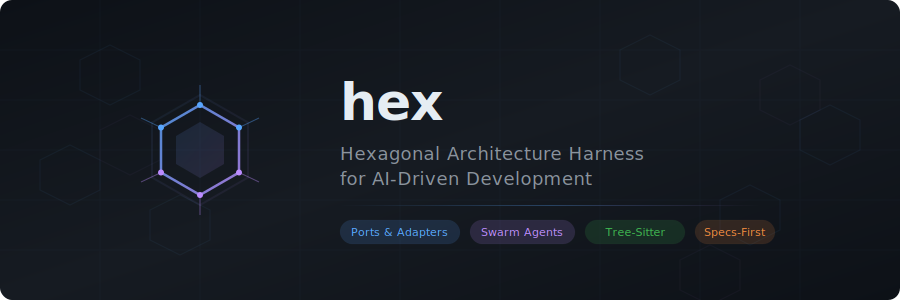

<p align="center">
  
</p>

<p align="center">
  <a href="https://www.rust-lang.org/"></a>
  <a href="https://github.com/gaberger/hex/blob/main/LICENSE"></a>
  <a href="docs/adrs/"></a>
  <a href="#architecture-enforcement-that-agents-cant-bypass"></a>
  <a href="#-two-modes-standalone-or-aios-linked"></a>
  <a href="docs/adrs/"></a>
</p>

<p align="center">
  <strong>The operating system for AI agents — local-first, self-improving, zero cloud required.</strong><br>
  <em>Run coding agents on your own hardware. Enforce architecture. Coordinate swarms. Get smarter every run.</em>
</p>

---

## The Problem

AI coding agents are powerful — but they're expensive, uncontrolled, and cloud-dependent. Every task pays the same price regardless of complexity. A typo fix costs as much as a feature implementation. And when you scale to multiple agents, you get conflicting edits, architecture violations, and no coordination.

**What if 70% of your agent tasks could run on a $0/month local model — with the same quality as frontier?** hex classifies tasks by complexity, routes simple work to fast local models, and only escalates to cloud when the task genuinely needs it. The system learns from every dispatch and gets better over time.

---

## What Is hex?

hex is an **AI Operating System (AIOS)** — a microkernel runtime that manages AI agents, coordinates distributed workloads, and enforces architectural constraints. It is not a standalone app; it is the **operating system layer** that gets installed into target projects to orchestrate AI-driven development.

**SpacetimeDB is required** — it provides the coordination core:
- Real-time state synchronization via WebSocket subscriptions
- Atomic reducers for swarm coordination, agent lifecycle, inference routing
- Memory persistence across runs for autonomous self-improvement

---

## Why Hex Is Different

Most agent frameworks are thin wrappers around LLM APIs. hex is different — it's an **operating system** for AI agents:

1. **70% of tasks run free** — T1 (scaffold/transform/script) and T2 (codegen) tasks execute on local models. Only complex reasoning escalates to frontier.

2. **Tiered inference routing** — 4B model handles typos at 68 tok/s. 32B model handles codegen at 11 tok/s. Frontier only when multi-file features need it.

3. **GBNF grammar constraints** — hard token-level masks force valid output. 2.8x faster (31s vs 89s) with same quality. No other framework does this.

4. **Best-of-N + compile gate** — generates N completions, returns the first that passes `cargo check`/`tsc --noEmit`. Observed 100% first-attempt compile rate on local 32B models.

5. **RL self-improvement** — Q-learning engine records every dispatch outcome. The system gets better the more you use it.

6. **Hexagonal enforcement at compile-time** — tree-sitter boundary checking. Agents physically cannot violate architecture rules.

7. **Native Rust** — sub-100ms coordination latency, single binary, no Python dependency.

---

## Key Features

- **[Architecture Enforcement](docs/ARCHITECTURE.md#architecture-enforcement-that-agents-cant-bypass)** — Tree-sitter boundary checking. Agents physically cannot violate hex rules. Grade: A+ (100/100).
- **[Tiered Inference](docs/INFERENCE.md)** — T1-T3 routing: 4B→32B→frontier. RL Q-learning self-optimizes.
- **[Code-First Execution](docs/INFERENCE.md#code-first-execution)** — Templates, AST transforms, scripts before inference. 14 of 20 workplan tasks need zero tokens.
- **[Swarm Coordination](docs/ARCHITECTURE.md#swarm-coordination-without-merge-conflicts)** — HexFlo: native Rust, <1ms latency, isolated git worktrees.
- **[Developer Experience](docs/DEVELOPER-EXPERIENCE.md)** — 4 layers: Pulse → Brief → Console → Override.
- **[Agent Security](docs/ARCHITECTURE.md#capability-based-agent-security)** — HMAC-SHA256 capability tokens, least-privilege scoping.

---

## Quick Start

### With Docker (recommended)

```bash
# Start SpacetimeDB + hex-nexus with one command
docker run -d --name hex \
  -p 5555:5555 -p 3033:3033 \
  -v $(pwd):/workspace \
  ghcr.io/gaberger/hex-nexus:latest

# Or use docker-compose
docker-compose up -d

# Install hex CLI
curl -L https://github.com/gaberger/hex/releases/latest/download/hex-darwin-arm64 -o /usr/local/bin/hex
chmod +x /usr/local/bin/hex
```

After starting, run `hex` for status + next steps. Open `http://localhost:5555` for the dashboard.

### Essential Commands

`hex` exposes a small, ambient-first surface:

```bash
hex                          # Status + next-step suggestions
hex go                       # Autonomous next-action — rebuild stale binaries, run validate, suggest fixes
hex hey <text>               # Natural-language interface — "hey calibrate inference"
hex brief                    # Progressive context brief (Pulse → Brief → Console)
hex config | dev | override  # Grouped subcommands
```

See [Getting Started](docs/GETTING-STARTED.md) for full installation and standalone setup.

---

## Autonomous Operation (Sched Daemon)

hex ships with a supervisor loop that validates the project and drains a task queue on a fixed tick. Pair it with `hex hey` for natural-language dispatch and `hex sched enqueue` for explicit work.

```bash
# 1. Start the supervisor in the background
hex sched daemon --background --interval 30

# 2. Enqueue work (natural language OR explicit)
hex hey calibrate inference                                  # Classified via keyword + local LLM fallback
hex hey --queue "rebuild nexus and run validate"             # Async — daemon picks it up on next tick
hex sched enqueue workplan docs/workplans/wp-foo.json        # Explicit workplan task
hex sched enqueue validate                                   # Run self-consistency checks

# 2a. Remote shell via SSH + LLM translation
hex hey check gpu memory on bazzite          # qwen3:4b translates → ssh bazzite rocm-smi
hex hey show disk usage on bazzite           # → ssh bazzite df
hex hey list running ollama models on bazzite  # → ssh bazzite ollama ps
# Per-host context lives in .hex/hosts.toml — OS/GPU/tooling hints that
# teach the LLM which commands are appropriate per machine.

# 3. Inspect & control
hex sched queue list                                         # Pending/in-flight/done tasks
hex sched validate                                           # Self-consistency: CLI wiring, binary freshness,
                                                             # workplan status, MCP parity, worktree health
hex sched daemon status                                      # PID, last tick, tick count
hex sched daemon stop                                        # Graceful shutdown
```

Every tick (default 30s) the daemon: runs `sched validate`, applies safe auto-fixes, drains one queued task. Code-first execution means most tasks complete without hitting an LLM — inference is an accelerator, not a gate. Strategy hints on workplan tasks route work to templates, AST transforms, or scripts first.

Related:
- `hex plan reconcile --update` — reconcile workplan status against git evidence
- `hex worktree merge` — integrity-verified merge with `cargo check` gate

---

## Formal Verification

hex ships TLA+ models of its coordination, scheduling, and feature-pipeline state machines under `docs/algebra/`, model-checked with TLC for safety and liveness. See [Formal Verification (TLA+)](docs/FORMAL-VERIFICATION.md) for the model catalogue, worked examples, and how to run TLC locally.

---

## System Architecture

```
hex-cli/               Rust CLI — shell + MCP server (canonical entry point)
hex-nexus/             Daemon — REST API, dashboard, filesystem bridge (optional for standalone)
hex-core/              Domain types + 10 port traits (zero external deps)
hex-agent/             Agent runtime — skills, hooks, architecture enforcement
hex-parser/            Code parsing utilities (tree-sitter)
spacetime-modules/    7 WASM modules (only needed for AIOS-linked mode)
```

hex is built as a Rust workspace with these deployment units:
- **hex-cli** — CLI entry point and MCP server
- **hex-nexus** — daemon bridging SpacetimeDB with the local filesystem
- **spacetime-modules** — WASM modules for coordination (always required)

See [Architecture](docs/ARCHITECTURE.md) for crate details, agent roles, enforcement rules.

---

## Documentation

| Doc | Description |
|:----|:------------|
| [Architecture](docs/ARCHITECTURE.md) | System components, enforcement rules, agent roles, swarm coordination, security |
| [Getting Started](docs/GETTING-STARTED.md) | Installation, essential commands, standalone mode, remote agents |
| [Inference](docs/INFERENCE.md) | Tiered routing, RL self-improvement, code-first execution, GBNF grammars, benchmarking |
| [Formal Verification](docs/FORMAL-VERIFICATION.md) | TLA+ models for coordination, scheduling, and feature-pipeline state machines |
| [Comparison](docs/COMPARISON.md) | hex vs BAML, SpecKit, HUD, LangChain, CrewAI, AutoGen, Claude Agent SDK |
| [Developer Experience](docs/DEVELOPER-EXPERIENCE.md) | Pulse/Brief/Console/Override layers, trust delegation, workplan dispatch |
| [Architecture Decision Records](docs/adrs/) | 161 decisions (151 accepted) — the "why" behind every design choice |
| [Development Guides](docs/guides/) | Workflow walkthrough, OpenRouter setup, feature UX integration |
| [Behavioral Specs](docs/specs/) | Feature specifications written before code |
| [Workplans](docs/workplans/) | Structured task decomposition driving HexFlo swarm execution |

---

## Who Is This For?

**Teams running AI coding agents at scale — especially those who want to own their inference.** If you're using Claude Code, Copilot, Cursor, or any LLM-powered coding tool and you've hit these problems:

- Agents violate architecture boundaries and you find out in code review
- Multi-agent runs produce merge conflicts or race conditions
- Every agent has full access to everything — no scoping, no least privilege
- You're paying frontier API prices for tasks a local model could handle
- You want to run agents on airgapped networks, on-prem hardware, or without cloud accounts

hex installs into your project as the operating system layer between your agents and your codebase. It's model-agnostic, provider-agnostic, and runs on local models by default.

---

## Credits & References

### Foundational Work

hex builds on the **Hexagonal Architecture** pattern (Ports & Adapters), originally conceived by [Alistair Cockburn](https://alistair.cockburn.us/hexagonal-architecture/) in 2005:

> *"Allow an application to equally be driven by users, programs, automated test or batch scripts, and to be developed and tested in isolation from its eventual run-time devices and databases."*

- **[Hexagonal Architecture](https://alistair.cockburn.us/hexagonal-architecture/)** — Alistair Cockburn
- **[Growing Object-Oriented Software, Guided by Tests](http://www.growing-object-oriented-software.com/)** — Steve Freeman & Nat Pryce (London-school TDD)
- **[Clean Architecture](https://blog.cleancoder.com/uncle-bob/2012/08/13/the-clean-architecture.html)** — Robert C. Martin

### Key Technologies

- **[tree-sitter](https://tree-sitter.github.io/)** — Max Brunsfeld et al. (AST-based architecture enforcement)
- **[SpacetimeDB](https://spacetimedb.com/)** — real-time database with WASM module execution
- **[claude-flow](https://github.com/ruvnet/claude-flow)** — Reuven Cohen (@ruvnet), multi-agent swarm coordination (predecessor to HexFlo)

### Authors

| Contributor | Role |
|:------------|:-----|
| **Gary** ([@gaberger](https://github.com/gaberger)) | Creator, architect, primary developer |
| **Claude** (Anthropic) | AI pair programmer — code generation, testing, documentation |

---

## License

[MIT](LICENSE)
