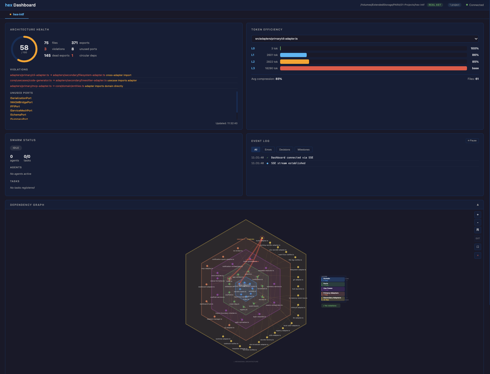

<p align="center">
  
</p>

<p align="center">
  <a href="#installation">= 20"/></a>
  <a href="https://www.npmjs.com/package/@anthropic-hex/hex"></a>
  <a href="#"></a>
  <a href="LICENSE"></a>
  <a href="#multi-language-support"></a>
  <a href="#multi-agent-swarm-coordination"></a>
</p>

<p align="center">
  <b>An AI-Assisted Integrated Development Environment (AAIDE) with opinionated hexagonal architecture enforcement.</b><br/>
  <sub>Typed port contracts &nbsp;|&nbsp; Static boundary analysis &nbsp;|&nbsp; Multi-agent swarm coordination &nbsp;|&nbsp; Token-efficient AST summaries</sub>
</p>

---

<br/>

## What is hex?

**hex** is an **AAIDE** — an AI-Assisted Integrated Development Environment. It is not an application you deploy; it is a **framework and toolchain** that gets installed into target projects to enforce hexagonal architecture (Ports & Adapters) during AI-driven development.

hex provides:
- **Mechanical architecture enforcement** via static analysis (`hex analyze`)
- **Multi-agent swarm coordination** for parallel feature development across adapter boundaries
- **Token-efficient code context** via tree-sitter AST summaries (L0–L3)
- **A control plane dashboard** for managing development across projects and systems
- **Inference integration** for local models, free models, and frontier models via SpacetimeDB procedures

### System Components

hex is composed of five deployment units that work together:

```
┌──────────────────────────────────────────────────────────────────────────────┐
│                           hex System Architecture                           │
│                                                                              │
│  ┌─────────────────┐     WebSocket      ┌─────────────────────────────────┐  │
│  │  hex-dashboard   │◄──────────────────►│         SpacetimeDB            │  │
│  │  (Control Plane) │    real-time sub    │  (Coordination & State Core)   │  │
│  │                  │                    │                                 │  │
│  │  Multi-project   │                    │  18 WASM modules:              │  │
│  │  monitoring,     │                    │  • hexflo-coordination         │  │
│  │  agent fleet     │                    │  • agent-registry              │  │
│  │  management,     │                    │  • inference-gateway           │  │
│  │  architecture    │                    │  • workplan-state              │  │
│  │  health views    │                    │  • chat-relay                  │  │
│  │                  │                    │  • fleet-state                 │  │
│  └─────────────────┘                    │  • architecture-enforcer       │  │
│                                          │  • + 11 more                   │  │
│  ┌─────────────────┐     WebSocket      │                                 │  │
│  │  hex Clients     │◄──────────────────►│  Provides:                     │  │
│  │  (Web, CLI,      │    real-time sub    │  • WebSocket pub/sub           │  │
│  │   Desktop)       │                    │  • Transactional reducers      │  │
│  └─────────────────┘                    │  • SQL query interface          │  │
│                                          │  • Automatic state replication  │  │
│  ┌─────────────────┐     REST API       │                                 │  │
│  │  hex-nexus       │◄──────────────────►│  ⚠ WASM modules CANNOT:        │  │
│  │  (Filesystem     │   reducer calls     │  • Access filesystems          │  │
│  │   Bridge)        │                    │  • Spawn processes             │  │
│  │                  │                    │  • Make network calls           │  │
│  │  Bridges the gap │                    │  • Execute shell commands       │  │
│  │  between STDB    │                    │                                 │  │
│  │  and local OS    │                    └─────────────────────────────────┘  │
│  └────────┬────────┘                                                         │
│           │                                                                  │
│           ▼                                                                  │
│  ┌─────────────────┐                    ┌─────────────────────────────────┐  │
│  │  Local OS        │                    │  hex-agent                      │  │
│  │  • File system   │                    │  (Architecture Enforcement)     │  │
│  │  • Git repos     │                    │                                 │  │
│  │  • Processes     │                    │  Runs locally or remotely.      │  │
│  │  • Shell         │                    │  Enforces hex architecture via: │  │
│  └─────────────────┘                    │  • Skills & hooks               │  │
│                                          │  • ADRs & workplans             │  │
│                                          │  • HexFlo dispatchers           │  │
│                                          │  • Agent system                 │  │
│                                          └─────────────────────────────────┘  │
└──────────────────────────────────────────────────────────────────────────────┘
```

#### SpacetimeDB — The Coordination & State Core

**SpacetimeDB must always be running to use hex.** It is the backbone of the system — every client (web, CLI, desktop) connects to it via WebSocket for real-time state synchronization.

SpacetimeDB is a Rust-native relational database that embeds application logic as WASM modules. hex uses it for:

| Capability | How It Works |
|:-----------|:-------------|
| **Real-time state sync** | All clients subscribe via WebSocket — no polling, instant updates |
| **Transactional coordination** | Reducers (stored procedures in WASM) provide atomic state transitions |
| **Swarm orchestration** | `hexflo-coordination` module tracks swarms, tasks, agents, and memory |
| **Inference routing** | `inference-gateway` module routes LLM requests to local, free, or frontier models |
| **Agent lifecycle** | `agent-registry` module tracks agent heartbeats, metrics, and status |
| **Architecture enforcement** | `architecture-enforcer` module validates boundary rules server-side |
| **Chat relay** | `chat-relay` module routes messages between agents and humans |

**Why SpacetimeDB instead of a REST API?** Traditional architectures require polling + hand-rolled coordination. SpacetimeDB gives hex automatic real-time replication — when one agent completes a task, every connected client sees the update instantly through their WebSocket subscription.

**18 WASM modules** live in `spacetime-modules/`, each compiled to `wasm32-unknown-unknown`:
```
spacetime-modules/
├── hexflo-coordination/     # Core: swarms, tasks, agents, memory, projects
├── agent-registry/          # Agent lifecycle + heartbeats
├── inference-gateway/       # LLM request routing
├── inference-bridge/        # Model integration
├── workplan-state/          # Task status + phase tracking
├── chat-relay/              # Message routing
├── fleet-state/             # Compute node registry
├── rl-engine/               # Q-learning tables
├── architecture-enforcer/   # Boundary rule validation
├── skill-registry/          # Skill metadata
├── agent-definition-registry/ # Agent definitions
├── hook-registry/           # Git hook management
├── file-lock-manager/       # Distributed file locks
├── conflict-resolver/       # State conflict resolution
├── secret-grant/            # Secret distribution
├── hexflo-cleanup/          # Stale agent detection
└── hexflo-lifecycle/        # Agent lifecycle events
```

#### hex-nexus — The Filesystem Bridge

hex-nexus exists because **SpacetimeDB WASM modules cannot access the filesystem, spawn processes, or make network calls** — this is by design (sandboxed execution). hex-nexus bridges this gap.

hex-nexus is a Rust daemon that:
- **Reads/writes files** on the local OS on behalf of SpacetimeDB operations
- **Runs architecture analysis** (tree-sitter parsing, boundary checking, cycle detection)
- **Manages git operations** (blame, diff, log, worktree management)
- **Syncs configuration** between repo files and SpacetimeDB tables on startup
- **Serves the dashboard** (assets baked into binary via `rust-embed`)
- **Exposes a REST API** that both the CLI and MCP tools delegate to

```bash
hex nexus start      # Start the daemon
hex nexus status     # Check health
# REST API at http://localhost:5555
```

**Config sync on startup** (ADR-044): When hex-nexus starts, it reads local config files and pushes them to SpacetimeDB:
- `.hex/blueprint.json` → `project_config` table
- `.claude/settings.json` → `project_config` (MCP servers, hooks)
- `.claude/skills/*.md` → `skill_registry` table
- `.claude/agents/*.yml` → `agent_definition` table

#### hex-agent — Architecture Enforcement Runtime

hex-agent is the component that **must always be present** — locally or remotely — on any system running hex development agents. It is the runtime environment for hex's AI agents, enforcing hexagonal architecture through:

| Mechanism | What It Enforces |
|:----------|:----------------|
| **Skills** | Claude Code slash commands (`/hex-scaffold`, `/hex-generate`, etc.) that guide AI agents to produce architecture-compliant code |
| **Hooks** | Pre/post operation hooks that validate boundaries, auto-format, and train patterns |
| **ADRs** | Architecture Decision Records that document and track design choices |
| **Workplans** | Structured task decomposition into adapter-bounded steps |
| **HexFlo dispatchers** | Native Rust coordination for multi-agent swarm execution |
| **Agent definitions** | YAML-defined agent roles (planner, coder, reviewer, etc.) with specific boundaries |

hex-agent uses hex's own agent system and HexFlo dispatchers for building software. It connects to SpacetimeDB for coordination and to hex-nexus for filesystem operations.

#### hex-dashboard — The Developer Control Plane

hex-dashboard is the **nexus of data and control** for developers using hex across many projects and systems. It is a control plane architecture that provides:

| Capability | Description |
|:-----------|:-------------|
| **Multi-project management** | Monitor and control multiple hex projects from a single view with live freshness indicators |
| **Agent fleet control** | View all active agents, their status, heartbeats, and assigned tasks across systems |
| **Architecture health** | Real-time architecture score ring with violation/dead-export breakdown per project |
| **Swarm visualization** | Task progress, agent topology, dependency graphs with violation highlighting |
| **Command execution** | Send commands (`hex analyze`, `spawn-agent`, `run-build`) to any connected project from the browser |
| **Inference monitoring** | Track LLM requests, model usage, and token consumption across agents |
| **Configuration management** | View and manage secrets, environment variables, and project settings |
| **Event stream** | Filterable real-time log of errors, decisions, milestones across all projects |

**Tech stack:** Solid.js + TailwindCSS frontend, baked into the hex-nexus binary at compile time. Real-time updates via SpacetimeDB WebSocket subscriptions.

```bash
hex nexus start           # Dashboard available at http://localhost:5555
open http://localhost:5555
```

The dashboard connects directly to SpacetimeDB for real-time data — it does not poll hex-nexus. This means agent status, task progress, and architecture health update instantly across all open browser tabs.

#### hex Clients — Web, CLI, Desktop

All hex clients connect to SpacetimeDB via WebSocket for real-time state:

| Client | Technology | Purpose |
|:-------|:-----------|:--------|
| **hex CLI** (`hex-cli/`) | Rust binary | Primary user interface — all hex commands |
| **hex Web** (dashboard) | Solid.js SPA | Browser-based control plane |
| **hex Desktop** (`hex-desktop/`) | Tauri wrapper | Native desktop app wrapping the web dashboard |

The CLI delegates to hex-nexus REST API for filesystem operations and queries SpacetimeDB directly for state. MCP tools (`hex mcp`) are served from the same binary, ensuring CLI and MCP share the same backend.

#### Inference — Model Integration

hex can leverage **local models, free models, or frontier models** for AI-driven development. Inference is routed through SpacetimeDB:

```
Agent → SpacetimeDB (inference-gateway reducer) → hex-nexus (HTTP bridge) → Model Provider
                                                                              ├── Local (Ollama, llama.cpp)
                                                                              ├── Free (Anthropic free tier, etc.)
                                                                              └── Frontier (Claude, GPT-4, etc.)
```

The `inference-gateway` and `inference-bridge` WASM modules handle request routing, load balancing, and response caching. hex-nexus performs the actual HTTP calls since WASM modules cannot make network requests.

<br/>

---

<br/>

## The Problem

> When AI agents generate code autonomously, they produce spaghetti. Adapters import other adapters. Domain logic leaks into HTTP handlers. Database queries appear in UI components. **No amount of prompt engineering prevents this at scale.**

Traditional AI coding tools improve the *conversation* with AI. hex improves the *output*.

<br/>

<p align="center">
  
</p>

<br/>

## Quick Start

```bash
# Scaffold a new hexagonal project
npx @anthropic-hex/hex scaffold my-app --lang typescript

# Initialize hex in an existing project (works on 100K+ LOC codebases)
npx @anthropic-hex/hex init --lang ts

# Analyze architecture health
npx @anthropic-hex/hex analyze .

# Generate token-efficient summaries for AI context
npx @anthropic-hex/hex summarize src/ --level L1
```

<br/>

---

<br/>

## Architecture

<p align="center">
  
</p>

<details>
<summary><b>How the layers work</b></summary>

<br/>

| Layer | May Import From | Purpose |
|:------|:---------------|:--------|
| `domain/` | `domain/` only | Pure business logic, zero external deps |
| `ports/` | `domain/` only | Typed interfaces — contracts between layers |
| `usecases/` | `domain/` + `ports/` | Application logic composing ports |
| `adapters/primary/` | `ports/` only | Driving: CLI, HTTP, MCP, Dashboard |
| `adapters/secondary/` | `ports/` only | Driven: FS, Git, LLM, TreeSitter, HexFlo, Secrets |
| `composition-root.ts` | Everything | The ONLY file that imports adapters |

**The golden rule:** Adapters NEVER import other adapters. This is the most common mistake AI agents make, and `hex analyze` catches it every time.

</details>

<br/>

### Port Contracts — What AI Agents Actually Implement

Ports are typed interfaces. When an AI agent is told "implement this adapter against this port," it has clear input/output contracts — not prose descriptions:

```typescript
// Port: the contract (what we need)
export interface IFileSystemPort {
  read(filePath: string): Promise<string>;
  write(filePath: string, content: string): Promise<void>;
  exists(filePath: string): Promise<boolean>;
  glob(pattern: string): Promise<string[]>;
  streamFiles(pattern: string, options?: StreamOptions): AsyncGenerator<string>;
}

// Adapter: the implementation (how we do it)
// AI generates this within its boundary — can't leak into other adapters
export class S3Adapter implements IFileSystemPort {
  async read(filePath: string): Promise<string> { /* S3 GetObject */ }
  async write(filePath: string, content: string): Promise<void> { /* S3 PutObject */ }
  async exists(filePath: string): Promise<boolean> { /* S3 HeadObject */ }
  async glob(pattern: string): Promise<string[]> { /* S3 ListObjectsV2 */ }
}
```

### Architecture Validation

```bash
$ hex analyze .

Architecture Analysis
=====================
Dead exports:     0 found
Hex violations:   0 found
Circular deps:    0 found

✓ All hexagonal boundary rules pass
```

When an adapter imports another adapter:
```diff
- Hex violations:   1 found
-   ✗ src/adapters/secondary/cache-adapter.ts imports from
-     src/adapters/secondary/filesystem-adapter.ts
-     Rule: adapters must NEVER import other adapters
```

<br/>

---

<br/>

## Specs-First Workflow

<p align="center">
  
</p>

<br/>

<table>
<tr>
<td width="50%">

### 1. Specify

```bash
hex plan "JWT auth with rate limiting"
```

Decomposes into adapter-bounded steps:

```yaml
steps:
  - adapter: secondary/auth
    port: IAuthPort
    task: "JWT generation + validation"
    tokenBudget: 4000

  - adapter: secondary/rate-limiter
    port: IRateLimitPort
    task: "Sliding window limiter"
    tokenBudget: 3000
```

</td>
<td width="50%">

### 2. Build

Each step generates code within its boundary.

The AI agent receives:
- The **port interface** (typed contract)
- **L1 summaries** of related code (token-efficient)
- The **behavioral spec** (acceptance criteria)

```bash
hex generate \
  --adapter secondary/auth \
  --port IAuthPort \
  --lang typescript
```

</td>
</tr>
<tr>
<td width="50%">

### 3. Test

Three levels, integrated into the workflow:

```bash
# Unit tests (mock ports, test logic)
bun test

# Property tests (fuzz inputs)
bun test --property

# Smoke tests (can it start?)
hex validate .
```

</td>
<td width="50%">

### 4–5. Validate & Ship

Validation is a **blocking gate**:

- [ ] Behavioral spec assertions pass
- [ ] Property test invariants hold
- [ ] Smoke scenarios succeed
- [ ] `hex analyze` finds no violations

Only then:
```bash
bun run build && git commit
```

</td>
</tr>
</table>

### Feature Progress Display

During feature development, hex shows a persistent status view that eliminates agent console noise:

```
hex feature: webhook-notifications
────────────────────────────────────────────────────────────────────────
Phase 1/7: SPECS     ✓ Complete (5 specs, 1 negative)
Phase 2/7: PLAN      ✓ Complete (8 tasks, 3 tiers)
Phase 3/7: WORKTREES ✓ Created 8 worktrees
Phase 4/7: CODE      ⟳ In Progress (3/8 done, 5 running)

Workplan:
  Tier 0 (domain/ports)
    ✓ domain-changes       (feat/webhook-notifications/domain)
    ✓ port-changes         (feat/webhook-notifications/ports)

  Tier 1 (adapters - parallel)
    ✓ git-adapter          Q:95  [===========] test
    ⟳ webhook-adapter      Q:82  [========---] lint
    ⟳ cli-adapter          Q:78  [=======----] test
    ⏳ mcp-adapter                [           ] queued
    ⏳ fs-adapter                 [           ] queued

  Tier 2 (integration)
    ⏳ composition-root          [           ] queued
    ⏳ integration-tests         [           ] queued

Overall: 38% │ Tokens: 124k/500k │ Time: 3m42s │ Blockers: 0
────────────────────────────────────────────────────────────────────────
[Press 'd' for details | 'q' to abort | 'h' for help]
```

Agent logs are redirected to `.hex/logs/agent-<name>.log` to keep the console clean. Press 'd' to view detailed logs, 'q' to abort cleanly, or 'h' for help. This is powered by `IFeatureProgressPort` with structured event streaming via the event bus.

<br/>

---

<br/>

## Multi-Agent Swarm Coordination

<p align="center">
  
</p>

<br/>

hex coordinates multiple AI agents working in parallel via [**HexFlo**] (formerly ruflo)(https://github.com/ruvnet/claude-flow) (`@claude-flow/cli`), with **lock-based coordination** to prevent duplicate work and file conflicts across instances (ADR-022).

<table>
<tr>
<td width="50%">

### Agent Roles

| Role | Responsibility |
|:-----|:--------------|
| `planner` | Decomposes requirements into tasks |
| `coder` | Implements one adapter boundary |
| `tester` | Writes unit + property tests |
| `reviewer` | Checks hex boundary violations |
| `integrator` | Merges worktrees, integration tests |
| `monitor` | Tracks progress, reports status |

</td>
<td width="50%">

### Swarm Configuration

```typescript
interface SwarmConfig {
  topology: 'hierarchical' | 'mesh'
            | 'hierarchical-mesh';
  maxAgents: number;       // default: 4
  strategy: 'specialized' | 'generalist'
            | 'adaptive';
  consensus: 'raft' | 'pbft';
  memoryNamespace: string;
}
```

</td>
</tr>
</table>

<details>
<summary><b>Swarm Port Interface (full)</b></summary>

```typescript
interface ISwarmPort {
  // Lifecycle
  init(config: SwarmConfig): Promise<SwarmStatus>;
  createTask(task: SwarmTask): Promise<SwarmTask>;
  completeTask(taskId: string, result: string, commitHash?: string): Promise<void>;
  spawnAgent(name: string, role: AgentRole, taskId?: string): Promise<SwarmAgent>;

  // Pattern learning — agents get smarter over time
  patternStore(pattern: AgentDBPattern): Promise<AgentDBPattern>;
  patternSearch(query: string, category?: string): Promise<AgentDBPattern[]>;
  patternFeedback(feedback: AgentDBFeedback): Promise<void>;

  // Persistent memory across sessions
  memoryStore(entry: SwarmMemoryEntry): Promise<void>;
  memoryRetrieve(key: string, namespace: string): Promise<string | null>;

  // Hierarchical memory (layer > namespace > key)
  hierarchicalStore(layer: string, namespace: string, key: string, value: string): Promise<void>;
  hierarchicalRecall(layer: string, namespace?: string): Promise<SwarmMemoryEntry[]>;

  // Intelligence
  consolidate(): Promise<{ merged: number; removed: number }>;
  contextSynthesize(query: string, sources?: string[]): Promise<string>;
  getProgressReport(): Promise<AgentDBProgressReport>;
}
```

</details>

### Dashboard — Control Plane

<p align="center">
  
</p>

The hex dashboard is the **developer control plane** — a single interface for managing AI-driven development across multiple projects and systems. It is served by hex-nexus (baked into the binary at compile time) and connects directly to SpacetimeDB for real-time state.

```bash
# Start hex-nexus (serves the dashboard)
hex nexus start

# Open in browser
open http://localhost:5555
```

**Control plane capabilities:**
- **Multi-project tabs** — switch between projects with live freshness indicators
- **Architecture health ring** — real-time score with violation/dead-export breakdown
- **Token efficiency panel** — L0–L3 compression bars per file
- **Agent fleet management** — agent list, heartbeat status, task assignments with pulse animations
- **Dependency graph** — interactive canvas with hexagonal ring layout, zoom/pan, click-to-trace transitive deps, violation highlighting
- **Command dispatch** — send commands (`hex analyze`, `spawn-agent`, `run-build`) to any connected project from the browser
- **Inference monitoring** — track model requests and token consumption across agents
- **Event log** — filterable real-time stream (errors, decisions, milestones)
- **Decision modal** — interactive prompts for agent decisions requiring human input

**State management:**
- **Primary**: SpacetimeDB — real-time sync across all clients via WebSocket subscriptions
- **Fallback**: SQLite (`~/.hex/hub.db`) — offline/single-node operation (ADR-025)
- Multi-instance coordination uses `ICoordinationPort` with worktree locks, task claiming, and activity broadcasting to prevent duplicate work and file conflicts (ADR-011, ADR-022)
- `SwarmOrchestrator` acquires locks before worktree creation; `WorkplanExecutor` claims tasks before agent spawn — conflicts throw typed `WorktreeConflictError` / `TaskConflictError`

<br/>

---

<br/>

## Multi-Channel Notifications

hex provides real-time feedback through four notification channels behind a single `INotificationEmitPort` interface:

<table>
<tr>
<th>Channel</th>
<th>Adapter</th>
<th>Purpose</th>
</tr>
<tr>
<td><b>Terminal</b></td>
<td><code>TerminalNotifier</code></td>
<td>Color-coded messages, persistent status bar, interactive decision prompts</td>
</tr>
<tr>
<td><b>File Log</b></td>
<td><code>FileLogNotifier</code></td>
<td>Structured JSONL audit trail in <code>.hex/activity.log</code>, rotated at 10 MB</td>
</tr>
<tr>
<td><b>Webhook</b></td>
<td><code>WebhookNotifier</code></td>
<td>External integration (Slack, CI); batched delivery with exponential-backoff retry</td>
</tr>
<tr>
<td><b>Event Bus</b></td>
<td><code>EventBusNotifier</code></td>
<td>In-memory pub/sub for agent-to-agent coordination; wildcard subscriptions</td>
</tr>
</table>

### Decision Requests

When agents encounter ambiguous choices (e.g., two valid architectural approaches), they emit a `DecisionRequest` with:
- Numbered options with risk ratings
- Configurable deadline (default: 5 minutes)
- Auto-select default option if no human response (prevents agent stalls)

### Status Line Format

```
[execute] coder-1: generating tests | quality: 85 | 3/6 adapters | ████░░ 50%
```

Fields: `[phase]`, active agent and step, quality score from `QualityScore.score`, adapter completion ratio, and a Unicode progress bar. All channels are independently testable via constructor-injected dependencies (no global state).

<br/>

---

<br/>

## Token-Efficient Summaries

> A 500-line adapter becomes a 30-line L1 summary. This is how AI agents understand your codebase without blowing their context window.

<table>
<tr>
<th>Level</th>
<th>What's Included</th>
<th>Tokens</th>
<th>Use Case</th>
</tr>
<tr>
<td><code>L0</code></td>
<td>File list only</td>
<td align="center">~2%</td>
<td>Project overview, file discovery</td>
</tr>
<tr>
<td><code>L1</code></td>
<td>Exports + function signatures</td>
<td align="center"><b>~6%</b></td>
<td><b>Ideal for AI context</b> — the sweet spot</td>
</tr>
<tr>
<td><code>L2</code></td>
<td>L1 + function bodies</td>
<td align="center">~40%</td>
<td>Detailed understanding of logic</td>
</tr>
<tr>
<td><code>L3</code></td>
<td>Full source code</td>
<td align="center">100%</td>
<td>Complete file contents</td>
</tr>
</table>

```bash
# Generate L1 summaries for the whole project
hex summarize src/ --level L1
```

Powered by [tree-sitter](https://tree-sitter.github.io/) (WASM) for language-agnostic AST extraction.

<br/>

---

<br/>

## hex vs SPECKit vs BMAD

<table>
<tr>
<th align="left">Capability</th>
<th align="center">SPECKit</th>
<th align="center">BMAD</th>
<th align="center">hex</th>
</tr>
<tr>
<td><b>Architecture enforcement</b></td>
<td align="center">-</td>
<td align="center">Docs only</td>
<td align="center"></td>
</tr>
<tr>
<td><b>Boundary violation detection</b></td>
<td align="center">-</td>
<td align="center">-</td>
<td align="center"></td>
</tr>
<tr>
<td><b>Adapter isolation</b></td>
<td align="center">-</td>
<td align="center">-</td>
<td align="center"></td>
</tr>
<tr>
<td><b>Multi-agent orchestration</b></td>
<td align="center">-</td>
<td align="center">Manual</td>
<td align="center"></td>
</tr>
<tr>
<td><b>Token efficiency</b></td>
<td align="center">-</td>
<td align="center">Sharding</td>
<td align="center"></td>
</tr>
<tr>
<td><b>Testing pipeline</b></td>
<td align="center">Spec-only</td>
<td align="center">TEA add-on</td>
<td align="center"></td>
</tr>
<tr>
<td><b>Parallel development</b></td>
<td align="center">Single branch</td>
<td align="center">Monolithic</td>
<td align="center"></td>
</tr>
<tr>
<td><b>Code gen scope</b></td>
<td align="center">Prose</td>
<td align="center">Lifecycle docs</td>
<td align="center"></td>
</tr>
<tr>
<td><b>Dead code detection</b></td>
<td align="center">-</td>
<td align="center">-</td>
<td align="center"></td>
</tr>
<tr>
<td><b>Pattern learning</b></td>
<td align="center">-</td>
<td align="center">-</td>
<td align="center"></td>
</tr>
</table>

<br/>

<details>
<summary><b>Why architecture-first beats spec-first</b></summary>

<br/>

**SPECKit** gives AI agents prose descriptions. The agent decides how to structure the code. Works for small features, produces spaghetti at scale. Known issues: duplicative documentation, incomplete implementations that "look done" in specs.

**BMAD** simulates an agile team with 12+ markdown personas. No real multi-agent orchestration — users manually invoke each persona. Architecture decisions are in documents, not enforced in code. Complexity grows with every persona added.

**hex** gives AI agents typed port interfaces. The agent knows exactly what methods to implement, what types to accept, and what boundary it's working within. Architecture is enforced mechanically.

The difference compounds:
- At **10 files**, any approach works
- At **100 files**, only enforced boundaries prevent collapse
- At **1000 files**, hex's static analysis is the difference between a maintainable codebase and a rewrite

</details>

<br/>

---

<br/>

## Installation

```bash
# Global install
npm install -g @anthropic-hex/hex

# Or use npx
npx @anthropic-hex/hex --help
```

**Requirements:** Node.js >= 20, [Bun](https://bun.sh/) (for build/test)

<br/>

---

<br/>

## CLI Reference

| Command | Description |
|:--------|:-----------|
| `hex build <requirements>` | **Single entry point** — auto-plans, orchestrates agents, generates code, analyzes, validates |
| `hex scaffold <name>` | Create a new hex project with full structure |
| `hex analyze <path>` | Architecture health check (dead code, violations, cycles) |
| `hex summarize <path> --level <L0-L3>` | Token-efficient AST summaries via tree-sitter |
| `hex generate` | Generate code within an adapter boundary |
| `hex plan <requirements>` | Decompose requirements into workplan steps |
| `hex validate <path>` | Post-build semantic validation (blocking gate) |
| `hex orchestrate` | Execute workplan steps via swarm agents |
| `hex status` | Swarm progress report |
| `hex daemon [start\|stop\|status]` | Manage hex-hub daemon (Rust dashboard service, port 5555) |
| `hex hub [start\|stop\|status]` | Alias for `hex daemon` |
| `hex dashboard` | Legacy Node.js dashboard (fallback if hex-hub binary not installed) |
| `hex mcp` | Start MCP stdio server for Claude Code / IDE integration |
| `hex setup` | Install tree-sitter grammars + skills + agents + hex-hub binary |
| `hex init [--fast\|--minimal\|--include\|--large-project]` | Initialize project (supports large codebases via streaming scanner) |
| `hex adr list` | List all ADRs with status |
| `hex adr status` | Show ADR lifecycle summary |
| `hex adr search <query>` | Search ADRs by keyword |
| `hex adr abandoned` | Detect stale/abandoned ADRs |
| `hex help` | Show all commands and usage |
| `hex version` | Print current version |

### ADR Lifecycle

Architecture Decision Records follow a tracked lifecycle with automated staleness detection:

```
proposed → accepted → (deprecated | superseded | rejected)
    ↓           ↓
  stale     abandoned (no git activity in 90 days)
```

**Commands:**
- `hex adr list [--status accepted]` — Filter by lifecycle status (proposed, accepted, deprecated, superseded, rejected)
- `hex adr status` — Show status distribution (e.g., "15 accepted, 3 proposed, 2 deprecated")
- `hex adr search <query>` — Full-text search across all ADR content and metadata
- `hex adr abandoned` — Detect stale ADRs with no related commits in 90 days (indicates forgotten decisions)

ADRs are stored in `docs/adrs/` and tracked via frontmatter (status, date, supersedes). The lifecycle system helps teams identify which architectural decisions are active vs. historical.

<br/>

---

<br/>

## Claude Code Integration

<table>
<tr>
<td width="50%">

### Skills (Slash Commands)

| Skill | Description |
|:------|:-----------|
| `/hex-feature-dev` | Full feature lifecycle with hex decomposition |
| `/hex-scaffold` | Scaffold new hex project |
| `/hex-generate` | Generate adapter code |
| `/hex-summarize` | Token-efficient summaries |
| `/hex-analyze-arch` | Architecture health check |
| `/hex-analyze-deps` | Dependency + tech stack analysis |
| `/hex-validate` | Post-build validation |

</td>
<td width="50%">

### MCP Tools

Available via `hex mcp`:

| Tool | Description |
|:-----|:-----------|
| `hex_build` | **Single entry point** — plans, orchestrates, analyzes, validates |
| `hex_analyze` | Architecture health check |
| `hex_analyze_json` | Analysis with JSON output |
| `hex_summarize` | Summarize a single file |
| `hex_summarize_project` | Summarize entire project |
| `hex_validate_boundaries` | Validate hex boundary rules |
| `hex_dead_exports` | Find unused exports |
| `hex_scaffold` | Scaffold a new project |
| `hex_generate` | Generate code from spec |
| `hex_plan` | Create workplan |
| `hex_orchestrate` | Run swarm orchestration |
| `hex_status` | Query swarm progress |
| `hex_dashboard_start` | Start dashboard server |
| `hex_dashboard_register` | Register project |
| `hex_dashboard_unregister` | Unregister project |
| `hex_dashboard_list` | List registered projects |
| `hex_dashboard_query` | Query dashboard data |
| `hex_hub_command` | Send command to hub (analyze, build, validate, claude) |
| `hex_hub_commands_list` | List pending/completed hub commands |
| `hex_hub_command_status` | Check status of a hub command |
| `hex_adr_list` | List all ADRs with status |
| `hex_adr_search` | Search ADRs by keyword |
| `hex_adr_status` | ADR lifecycle summary |
| `hex_adr_abandoned` | Detect stale/abandoned ADRs |
| `hex_secrets_has` | Check if a secret key exists |
| `hex_secrets_resolve` | Resolve a secret value |
| `hex_secrets_status` | Show secrets adapter chain status |

</td>
</tr>
</table>

### Agent Definitions

Pre-built YAML agents for swarm orchestration:

<table>
<tr>
<td><code>planner</code></td>
<td><code>hex-coder</code></td>
<td><code>integrator</code></td>
<td><code>swarm-coordinator</code></td>
<td><code>dependency-analyst</code></td>
</tr>
<tr>
<td><code>dead-code-analyzer</code></td>
<td><code>validation-judge</code></td>
<td><code>behavioral-spec-writer</code></td>
<td><code>scaffold-validator</code></td>
<td><code>status-monitor</code></td>
</tr>
<tr>
<td><code>dev-tracker</code></td>
<td colspan="4"></td>
</tr>
</table>

<br/>

---

<br/>

## Multi-Language Support

Powered by [tree-sitter](https://tree-sitter.github.io/) WASM for language-agnostic AST extraction:

| Capability | TypeScript | Go | Rust |
|:-----------|:----------:|:--:|:----:|
| **AST Summarize** (L0–L3) | Full | Full | Full |
| **Export extraction** | `export` keyword | Capitalized names | `pub` visibility |
| **Import extraction** | `import` statements | `import` declarations | `use` declarations |
| **Boundary validation** | Full | Full | Full |
| **Code generation** | Full (TS rules) | Full (Go rules) | Full (Rust rules) |
| **Path resolution** | `.js` → `.ts` | Module paths | `crate::` paths |
| **Scaffold** | `package.json` + `tsconfig.json` | `go.mod` | `Cargo.toml` |
| **Example project** | 4 apps | 1 (weather) | 1 (rust-api) |

### Build Enforcement

hex enforces compile/lint/test checks for all languages via `IBuildPort`:

| Method    | TypeScript          | Go                    | Rust                    |
|-----------|--------------------|-----------------------|-------------------------|
| compile() | `tsc --noEmit`     | `go build ./...`      | `cargo check`           |
| lint()    | `eslint --format json` | `golangci-lint run --out-format json` | `cargo clippy -- -D warnings` |
| test()    | `bun test`         | `go test ./... -json` | `cargo test`            |

The pre-commit hook automatically detects staged file languages and runs the corresponding toolchain checks. CI includes a `rust-check` job for hex-hub validation (compiles, lints, tests, and verifies `--build-hash` works).

<details>
<summary><b>Example: Go Backend (Weather API)</b></summary>

<br/>

The `examples/weather/` directory shows hex applied to a Go project:

```
examples/weather/backend/src/
  core/
    domain/               # Weather types, F1 race data
    ports/                # IWeatherPort, ICachePort
    usecases/             # F1Service (composes ports)
  adapters/
    primary/
      http_adapter.go     # HTTP handlers + HTML templates
    secondary/
      jolpica_adapter.go  # External F1 API client
      cache_adapter.go    # In-memory cache with TTL
  composition-root.go     # Wires adapters to ports
```

Same hexagonal rules, different language. The architecture transfers.

</details>

<br/>

---

<br/>

## Project Structure

```
# ── Rust Workspace (7 crates) ──────────────────────────────────────────────

hex-cli/                 # CLI binary — canonical user entry point (all hex commands)
hex-nexus/               # Filesystem bridge daemon (axum REST API, port 5555)
  src/
    analysis/            #   Architecture analysis (tree-sitter, boundary checking)
    coordination/        #   HexFlo swarm coordination (ADR-027)
    adapters/            #   SpacetimeDB + SQLite state adapters
    config_sync.rs       #   Repo → SpacetimeDB config sync on startup (ADR-044)
    git/                 #   Git introspection (blame, diff, worktree mgmt)
    orchestration/       #   Agent manager, constraint enforcer, workplan executor
  assets/                #   Dashboard frontend (Solid.js + TailwindCSS, rust-embed'd)
    src/spacetimedb/     #     Auto-generated SpacetimeDB client bindings
hex-core/                # Shared domain types & port traits (zero external deps)
hex-agent/               # Architecture enforcement runtime (agent runtime for AI dev agents)
hex-desktop/             # Desktop app (Tauri wrapper for dashboard)
hex-parser/              # Code parsing utilities

# ── SpacetimeDB WASM Modules ──────────────────────────────────────────────

spacetime-modules/       # 18 WASM modules compiled to wasm32-unknown-unknown
  hexflo-coordination/   #   Core: swarms, tasks, agents, memory, projects, config
  agent-registry/        #   Agent lifecycle + heartbeats
  inference-gateway/     #   LLM request routing
  workplan-state/        #   Task status + phase tracking
  chat-relay/            #   Message routing between agents and humans
  fleet-state/           #   Compute node registry
  architecture-enforcer/ #   Server-side boundary rule validation
  # ... + 11 more modules

# ── TypeScript Library ─────────────────────────────────────────────────────

src/
  core/
    domain/              # Value objects, entities, domain events
    ports/               # Typed interfaces (31 port files)
    usecases/            # Application logic (swarm, checkpoint, code-gen)
  adapters/
    primary/             # CLI, MCP, Dashboard, Notifications (9 files)
    secondary/           # FS, Git, TreeSitter, LLM, HexFlo, Build, Secrets (42 files)
  infrastructure/        # Tree-sitter query definitions
  composition-root.ts    # Single DI wiring point — ONLY file importing adapters
  cli.ts                 # CLI entry point
  index.ts               # Library public API

# ── Supporting ─────────────────────────────────────────────────────────────

tests/
  unit/                  # London-school mock-first tests
  integration/           # Real adapter tests
examples/                # Reference apps (flappy-bird, weather, rust-api, todo-app, etc.)
agents/                  # Agent definitions (14 YAML files, shipped in npm package)
skills/                  # Skill definitions (6 Markdown files, shipped in npm package)
.claude/
  skills/                # Claude Code skills (slash commands for IDE integration)
  agents/                # Claude Code agent definitions
config/                  # Language configs, tree-sitter settings
docs/
  adrs/                  # 37 Architecture Decision Records
  specs/                 # Behavioral specifications
  workplans/             # Feature workplans
  analysis/              # Adversarial review reports
```

<br/>

---

<br/>

## Status Line

hex includes a status line script that shows real-time swarm and project health directly in your Claude Code terminal:

```
⬡ hex │ my-app │ ⎇main │ ●swarm 2⚡ [3/5] │ ●db │ ◉localhost:3456 │ ◉mcp │ 87/100
```

Indicators:
- **Swarm** — `●` green (agents active) / `●` yellow (available, idle) / `○` dim (not configured)
- **Agent counts** — `2⚡` active, `1💤` idle, `[3/5]` tasks completed
- **AgentDB** — pattern store connectivity
- **Dashboard** — clickable URL when running (auto-starts on project load)
- **MCP** — hex MCP server status
- **Score** — last architecture health score

Three-tier detection: `.hex/status.json` (written by hooks) → `~/.claude-flow/metrics` (daemon) → HexFlo MCP config (fallback). Auto-configured during `hex init`.

<br/>

---

<br/>

## Build & Test

```bash
# Rust (primary — what users run)
cargo build -p hex-cli --release     # Build hex CLI binary
cargo build -p hex-nexus --release   # Build hex-nexus daemon (includes dashboard)

# TypeScript library (secondary — ports, adapters, tree-sitter)
bun run build        # Bundle TS library to dist/
bun test             # Run all tests (unit + property + smoke)
bun run check        # TypeScript type check (no emit)

# hex commands
hex analyze .        # Architecture validation
hex nexus start      # Start nexus daemon (dashboard at :5555)
hex setup            # Install grammars + skills + agents

# SpacetimeDB modules
cd spacetime-modules && spacetime build   # Compile WASM modules
spacetime publish hex-nexus               # Deploy to SpacetimeDB instance
```

<br/>

---

<br/>

## Design Decisions

<details>
<summary><b>Why these choices?</b></summary>

<br/>

| Decision | Rationale |
|:---------|:---------|
| **Tree-sitter over regex** | WASM-based AST extraction works across languages; regex breaks on edge cases |
| **Hybrid TS+Rust via NAPI** | Tree-sitter hot path in native Rust (5-10x faster than WASM); falls back to WASM if binary unavailable (ADR-010) |
| **HexFlo as required dep** | Swarm coordination is not optional; even solo workflows benefit from task tracking |
| **Single composition root** | Only one file imports adapters; adapter swaps are one-line changes |
| **L0-L3 summary levels** | AI agents need different detail at different phases; L1 is the sweet spot |
| **Worktree isolation** | Each agent gets a git worktree, not just a branch; prevents merge conflicts |
| **`safePath()` protection** | FileSystemAdapter prevents path traversal outside project root |
| **`execFile` not `exec`** | RufloAdapter prevents shell injection from untrusted inputs |
| **London-school testing** | Mock ports, test logic; hexagonal architecture makes this natural |
| **No `mock.module()`** | Tests use dependency injection (Deps pattern), never `mock.module()` — prevents mock/prod divergence (ADR-014) |
| **Streaming filesystem scanner** | `streamFiles()` uses an async generator with BFS queue and inode tracking — bounded memory regardless of project size (ADR-021) |
| **`.hexignore` defaults** | Smart exclusions (target/, node_modules/, build/) prevent OOM on large projects; falls back to `.gitignore` |
| **Lock-before-worktree** | `SwarmOrchestrator` acquires coordination lock before creating worktree; prevents parallel agents from stomping each other (ADR-022) |
| **Claim-before-spawn** | `WorkplanExecutor` claims tasks via hub before spawning agents; prevents duplicate work across instances |
| **`hex_build` single entry point** | Users describe what to build; hex handles plan → orchestrate → analyze → validate internally |
| **Pluggable secrets chain** | `ISecretsPort` adapters stack: Infisical → LocalVault → env-var; composition root selects |
| **Dashboard auto-start** | Dashboard HTTP server launches on project load; port conflicts and stale locks self-heal |
| **Rust hub over Node hub** | 1.5MB binary vs Node.js process; zero runtime deps; system-wide daemon serves all projects |
| **WebSocket over SSE** | Unified bidirectional channel for events, commands, and chat; 25s keepalive pings detect dead connections |
| **`run-claude` hub command** | Invoke Claude CLI from dashboard chat; enables browser-based agent interaction without terminal |

</details>

<br/>

## Secrets Management

hex includes `ISecretsPort` with a pluggable adapter chain for secret resolution:

| Adapter | When It's Used |
|:--------|:--------------|
| `InfisicalAdapter` | Production — fetches from [Infisical](https://infisical.com) vault |
| `LocalVaultAdapter` | Development — encrypted local file (`~/.hex/vault.json`) |
| `EnvSecretsAdapter` | Fallback — reads from environment variables |
| `CachingSecretsAdapter` | Wraps any adapter with TTL-based in-memory cache |

The composition root selects the adapter chain based on environment. Secrets never leak into domain or adapter code — only the composition root calls `ISecretsPort`.

## Security

| Protection | Implementation |
|:-----------|:--------------|
| Path traversal | `FileSystemAdapter.safePath()` blocks `../` escapes |
| Shell injection | `HexFloAdapter` uses `execFile` (not `exec`) |
| Secret management | `ISecretsPort` — Infisical / LocalVault / env-var adapter chain |
| XSS prevention | Primary adapters must not use `innerHTML` with external data |
| Credential safety | `.env` files are gitignored; `.env.example` provided |
| Dashboard auth | Bearer token authentication for HTTP endpoints |
| Pre-commit gate | Security audit hook blocks commits with violations |

<br/>

---

<br/>

## Credits & References

hex builds on the **Hexagonal Architecture** pattern (also known as **Ports and Adapters**), originally conceived by **Alistair Cockburn** in 2005.

> *"Allow an application to equally be driven by users, programs, automated test or batch scripts, and to be developed and tested in isolation from its eventual run-time devices and databases."*
> — Alistair Cockburn

### Foundational Work

- **[Hexagonal Architecture](https://alistair.cockburn.us/hexagonal-architecture/)** — Alistair Cockburn's original article defining the Ports and Adapters pattern
- **[Growing Object-Oriented Software, Guided by Tests](http://www.growing-object-oriented-software.com/)** — Steve Freeman & Nat Pryce. The London-school TDD approach that hex's test strategy follows
- **[Clean Architecture](https://blog.cleancoder.com/uncle-bob/2012/08/13/the-clean-architecture.html)** — Robert C. Martin. Concentric dependency rule that hex enforces via static analysis

### Key Technologies

- **[tree-sitter](https://tree-sitter.github.io/)** — Max Brunsfeld et al. Language-agnostic parsing framework powering hex's L0-L3 AST summaries
- **[HexFlo / claude-flow](https://github.com/ruvnet/claude-flow)** — Reuven Cohen ([@ruvnet](https://github.com/ruvnet)). Multi-agent swarm coordination framework
- **[Infisical](https://github.com/Infisical/infisical)** — Open-source secrets management platform integrated via `ISecretsPort`

### Authors

| Contributor | Role |
|:------------|:-----|
| **Gary** ([@gaberger](https://github.com/gaberger/hex)) | Creator, architect, primary developer |
| **Claude** (Anthropic) | AI pair programmer — code generation, testing, documentation |

### License

[MIT](LICENSE) — Use it, fork it, build on it.

<br/>


## Architecture Decisions

<!-- hex:adr-summary — auto-updated by hex -->
| ADR | Title | Status |
|-----|-------|--------|
| 001 | Hexagonal Architecture as Foundational Pattern | Accepted |
| 002 | Tree-Sitter for Token-Efficient LLM Communication | Accepted |
| 003 | Multi-Language Support — TypeScript, Go, Rust | Accepted |
| 004 | Git Worktrees for Parallel Agent Isolation | Accepted |
| 005 | Compile-Lint-Test Feedback Loop with Quality Gates | Accepted |
| 006 | Skills, Agent Definitions, and npm Packaging | Accepted |
| 007 | Multi-Channel Notification System | Accepted |
| 008 | Dogfooding — hex Built with Hexagonal Architecture | Accepted |
| 009 | Ruflo (claude-flow) as Required Dependency | Superseded by ADR-027 (HexFlo) |
| 010 | TypeScript-to-Rust Migration Cost and Risk Analysis | Accepted |
| 011 | Coordination and Multi-Instance Locking | Accepted |
| 012 | ADR Lifecycle Tracking | Accepted |
| 013 | Secrets Management | Accepted |
| 014 | Ban mock.module() — Use Dependency Injection for Test Isolation | Accepted |
| 015 | SQLite Persistence for Hub Swarm State | Accepted |
| 016 | Hub Binary Version Verification | Superseded by ADR-032 |
| 017 | Unlink Binary Before Copy to Avoid macOS Inode-Based SIGKILL Cache | Accepted |
| 018 | Multi-Language Build Enforcement (Go + Rust) | Accepted |
| 019 | CLI–MCP Parity — Every Command Must Have an MCP Equivalent | Accepted |
| 020 | Feature Development UX Improvement | Accepted |
| 021 | Hex Initialization Memory Exhaustion in Existing Large Projects | Accepted |
| 022 | Wire Coordination into Use Cases (Last-Mile Fix) | Accepted |
| 023 | Dashboard Session Cleanup and State Synchronization | Accepted |
| 024 | Hex-Hub Autonomous Nexus Architecture | Accepted |
| 025 | SpacetimeDB as Distributed State Backend | Accepted |
| 026 | Secure Secret Distribution via SpacetimeDB Coordination | Accepted |
| 027 | HexFlo — Replace Ruflo with Native Swarm Coordination | Accepted |
| 028 | API Optimization Layer | Accepted |
| 029 | Haiku Preflight Checks & Automatic Context Compaction | Accepted |
| 030 | Multi-Provider Inference Broker | Accepted |
| 031 | RL-Driven Model Selection & Token Budget Management | Accepted (documenting existing implementation) |
| 032 | Deprecate hex-hub — Consolidate into hex-nexus and hex-agent | Accepted |
| 032b | Deprecate SQLite, Migrate HexFlo to SpacetimeDB | Accepted |
| 033 | MCP Client Support for hex-agent | Accepted |
| 034 | Migrate Hex Analyzer from TypeScript to Rust | Accepted |
| 035 | Hex Architecture V2 — Rust-First, SpacetimeDB-Native, Pluggable Inference | Accepted |
| 036 | hex-chat Session Architecture | Deprecated — hex-chat removed (2026-03-22) |
| 037 | Agent Lifecycle — Local Default + Remote Connect | Accepted |
| 038 | Vite for Development, Axum for Production | Accepted |
| 039 | Nexus Agent Control Plane — OpenCode-Inspired Multi-Project Interface | Accepted |
| 040 | Remote Agent Transport — WebSocket over SSH with SpacetimeDB Coordination | Accepted |
| 041 | ADR Review Agent — Architectural Consistency Guardian | Accepted |
| 042 | SpacetimeDB Skill Lifecycle — Ingest, Select, Serialize | Accepted |
| 043 | Project Manifest + Auto-Registration via SpacetimeDB | Accepted |
| 044 | Nexus Git Integration — Project-Scoped Git Intelligence | Accepted |
| 045 | Project-Scoped ADRs, Config Templates, and Embedded Chat | Accepted |
| 046 | SpacetimeDB Single Authority for State Mutations | Accepted |
| 046 | Workplan Lifecycle Management — Creation, Tracking, and Reporting | Accepted |
| 047 | Internal Documentation System | Accepted |
| 048 | Claude Code Session Agent Registration | Accepted |
| 049 | Embedded Settings Template — Single Source of Truth | Accepted |
| 050 | Hook-Enforced Agent Lifecycle Pipeline | Accepted |
| 051 | SpacetimeDB as Single Source of State | Accepted |
| 052 | AIIDE — Hex Nexus as AI Integrated Development Environment | Accepted |
| 053 | Framework Configuration Sync to SpacetimeDB | Accepted |
| 054 | ADR Compliance Enforcement — Preventing Architectural Drift | Proposed |
| 055 | README-Driven Project Specification | Accepted |
| 056 | Frontend Hexagonal Architecture — Preventing UI Species Drift | Proposed |
| 057 | Unified Test Harness & Linting Pipeline | Accepted |
<!-- /hex:adr-summary -->

---

<br/>

<p align="center">
  
  &nbsp;
  
  &nbsp;
  
</p>

<p align="center">
  <sub>Built for AI agents that write code, not just chat about it.</sub>
</p>

<p align="center">
  <a href="#quick-start">Quick Start</a> &nbsp;&bull;&nbsp;
  <a href="#architecture">Architecture</a> &nbsp;&bull;&nbsp;
  <a href="#specs-first-workflow">Workflow</a> &nbsp;&bull;&nbsp;
  <a href="#multi-agent-swarm-coordination">Swarm</a> &nbsp;&bull;&nbsp;
  <a href="#cli-reference">CLI</a> &nbsp;&bull;&nbsp;
  <a href="#claude-code-integration">Claude Code</a>
</p>
