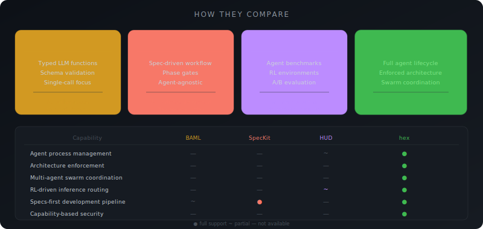
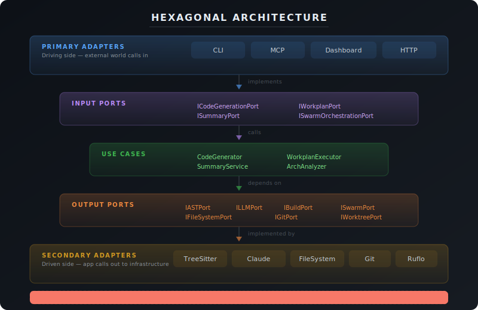
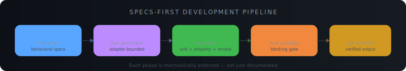
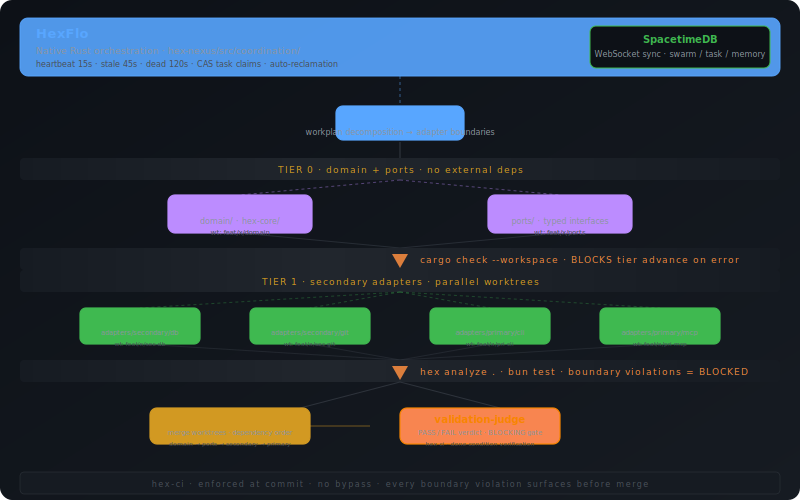

<p align="center">
  
</p>

<p align="center">
  <a href="#installation">= 20"/></a>
  <a href="https://www.npmjs.com/package/hex"></a>
  <a href="#"></a>
  <a href="LICENSE"></a>
  <a href="#multi-language-support"></a>
  <a href="#multi-agent-swarm-coordination"></a>
</p>

<p align="center">
  <b>Give AI coding agents mechanical architecture enforcement — not just prompt templates.</b><br/>
  <sub>Typed port contracts &nbsp;|&nbsp; Static boundary analysis &nbsp;|&nbsp; Multi-agent swarm coordination &nbsp;|&nbsp; Token-efficient AST summaries</sub>
</p>

---

<br/>

## The Problem

> When AI agents generate code autonomously, they produce spaghetti. Adapters import other adapters. Domain logic leaks into HTTP handlers. Database queries appear in UI components. **No amount of prompt engineering prevents this at scale.**

Traditional AI coding tools improve the *conversation* with AI. hex improves the *output*.

<br/>

<p align="center">
  
</p>

<br/>

## Quick Start

```bash
# Scaffold a new hexagonal project
npx hex scaffold my-app --lang typescript

# Analyze architecture health
npx hex analyze .

# Generate token-efficient summaries for AI context
npx hex summarize src/ --level L1
```

<br/>

---

<br/>

## Architecture

<p align="center">
  
</p>

<details>
<summary><b>How the layers work</b></summary>

<br/>

| Layer | May Import From | Purpose |
|:------|:---------------|:--------|
| `domain/` | `domain/` only | Pure business logic, zero external deps |
| `ports/` | `domain/` only | Typed interfaces — contracts between layers |
| `usecases/` | `domain/` + `ports/` | Application logic composing ports |
| `adapters/primary/` | `ports/` only | Driving: CLI, HTTP, MCP, Dashboard |
| `adapters/secondary/` | `ports/` only | Driven: FS, Git, LLM, TreeSitter, Ruflo, Secrets |
| `composition-root.ts` | Everything | The ONLY file that imports adapters |

**The golden rule:** Adapters NEVER import other adapters. This is the most common mistake AI agents make, and `hex analyze` catches it every time.

</details>

<br/>

### Port Contracts — What AI Agents Actually Implement

Ports are typed interfaces. When an AI agent is told "implement this adapter against this port," it has clear input/output contracts — not prose descriptions:

```typescript
// Port: the contract (what we need)
export interface IFileSystemPort {
  read(filePath: string): Promise<string>;
  write(filePath: string, content: string): Promise<void>;
  exists(filePath: string): Promise<boolean>;
  glob(pattern: string): Promise<string[]>;
}

// Adapter: the implementation (how we do it)
// AI generates this within its boundary — can't leak into other adapters
export class S3Adapter implements IFileSystemPort {
  async read(filePath: string): Promise<string> { /* S3 GetObject */ }
  async write(filePath: string, content: string): Promise<void> { /* S3 PutObject */ }
  async exists(filePath: string): Promise<boolean> { /* S3 HeadObject */ }
  async glob(pattern: string): Promise<string[]> { /* S3 ListObjectsV2 */ }
}
```

### Architecture Validation

```bash
$ hex analyze .

Architecture Analysis
=====================
Dead exports:     0 found
Hex violations:   0 found
Circular deps:    0 found

✓ All hexagonal boundary rules pass
```

When an adapter imports another adapter:
```diff
- Hex violations:   1 found
-   ✗ src/adapters/secondary/cache-adapter.ts imports from
-     src/adapters/secondary/filesystem-adapter.ts
-     Rule: adapters must NEVER import other adapters
```

<br/>

---

<br/>

## Specs-First Workflow

<p align="center">
  
</p>

<br/>

<table>
<tr>
<td width="50%">

### 1. Specify

```bash
hex plan "JWT auth with rate limiting"
```

Decomposes into adapter-bounded steps:

```yaml
steps:
  - adapter: secondary/auth
    port: IAuthPort
    task: "JWT generation + validation"
    tokenBudget: 4000

  - adapter: secondary/rate-limiter
    port: IRateLimitPort
    task: "Sliding window limiter"
    tokenBudget: 3000
```

</td>
<td width="50%">

### 2. Build

Each step generates code within its boundary.

The AI agent receives:
- The **port interface** (typed contract)
- **L1 summaries** of related code (token-efficient)
- The **behavioral spec** (acceptance criteria)

```bash
hex generate \
  --adapter secondary/auth \
  --port IAuthPort \
  --lang typescript
```

</td>
</tr>
<tr>
<td width="50%">

### 3. Test

Three levels, integrated into the workflow:

```bash
# Unit tests (mock ports, test logic)
bun test

# Property tests (fuzz inputs)
bun test --property

# Smoke tests (can it start?)
hex validate .
```

</td>
<td width="50%">

### 4–5. Validate & Ship

Validation is a **blocking gate**:

- [ ] Behavioral spec assertions pass
- [ ] Property test invariants hold
- [ ] Smoke scenarios succeed
- [ ] `hex analyze` finds no violations

Only then:
```bash
bun run build && git commit
```

</td>
</tr>
</table>

<br/>

---

<br/>

## Multi-Agent Swarm Coordination

<p align="center">
  
</p>

<br/>

hex coordinates multiple AI agents working in parallel via [**ruflo**](https://github.com/ruvnet/claude-flow) (`@claude-flow/cli`).

<table>
<tr>
<td width="50%">

### Agent Roles

| Role | Responsibility |
|:-----|:--------------|
| `planner` | Decomposes requirements into tasks |
| `coder` | Implements one adapter boundary |
| `tester` | Writes unit + property tests |
| `reviewer` | Checks hex boundary violations |
| `integrator` | Merges worktrees, integration tests |
| `monitor` | Tracks progress, reports status |

</td>
<td width="50%">

### Swarm Configuration

```typescript
interface SwarmConfig {
  topology: 'hierarchical' | 'mesh'
            | 'hierarchical-mesh';
  maxAgents: number;       // default: 4
  strategy: 'specialized' | 'generalist'
            | 'adaptive';
  consensus: 'raft' | 'pbft';
  memoryNamespace: string;
}
```

</td>
</tr>
</table>

<details>
<summary><b>Swarm Port Interface (full)</b></summary>

```typescript
interface ISwarmPort {
  // Lifecycle
  init(config: SwarmConfig): Promise<SwarmStatus>;
  createTask(task: SwarmTask): Promise<SwarmTask>;
  completeTask(taskId: string, result: string, commitHash?: string): Promise<void>;
  spawnAgent(name: string, role: AgentRole, taskId?: string): Promise<SwarmAgent>;

  // Pattern learning — agents get smarter over time
  patternStore(pattern: AgentDBPattern): Promise<AgentDBPattern>;
  patternSearch(query: string, category?: string): Promise<AgentDBPattern[]>;
  patternFeedback(feedback: AgentDBFeedback): Promise<void>;

  // Persistent memory across sessions
  memoryStore(entry: SwarmMemoryEntry): Promise<void>;
  memoryRetrieve(key: string, namespace: string): Promise<string | null>;

  // Hierarchical memory (layer > namespace > key)
  hierarchicalStore(layer: string, namespace: string, key: string, value: string): Promise<void>;
  hierarchicalRecall(layer: string, namespace?: string): Promise<SwarmMemoryEntry[]>;

  // Intelligence
  consolidate(): Promise<{ merged: number; removed: number }>;
  contextSynthesize(query: string, sources?: string[]): Promise<string>;
  getProgressReport(): Promise<AgentDBProgressReport>;
}
```

</details>

### Dashboard

```bash
hex dashboard --port 3456
```

Real-time web UI with WebSocket updates showing agent status, task progress, and architecture health.

<br/>

---

<br/>

## Token-Efficient Summaries

> A 500-line adapter becomes a 30-line L1 summary. This is how AI agents understand your codebase without blowing their context window.

<table>
<tr>
<th>Level</th>
<th>What's Included</th>
<th>Tokens</th>
<th>Use Case</th>
</tr>
<tr>
<td><code>L0</code></td>
<td>File list only</td>
<td align="center">~2%</td>
<td>Project overview, file discovery</td>
</tr>
<tr>
<td><code>L1</code></td>
<td>Exports + function signatures</td>
<td align="center"><b>~6%</b></td>
<td><b>Ideal for AI context</b> — the sweet spot</td>
</tr>
<tr>
<td><code>L2</code></td>
<td>L1 + function bodies</td>
<td align="center">~40%</td>
<td>Detailed understanding of logic</td>
</tr>
<tr>
<td><code>L3</code></td>
<td>Full source code</td>
<td align="center">100%</td>
<td>Complete file contents</td>
</tr>
</table>

```bash
# Generate L1 summaries for the whole project
hex summarize src/ --level L1
```

Powered by [tree-sitter](https://tree-sitter.github.io/) (WASM) for language-agnostic AST extraction.

<br/>

---

<br/>

## hex vs SPECKit vs BMAD

<table>
<tr>
<th align="left">Capability</th>
<th align="center">SPECKit</th>
<th align="center">BMAD</th>
<th align="center">hex</th>
</tr>
<tr>
<td><b>Architecture enforcement</b></td>
<td align="center">-</td>
<td align="center">Docs only</td>
<td align="center"></td>
</tr>
<tr>
<td><b>Boundary violation detection</b></td>
<td align="center">-</td>
<td align="center">-</td>
<td align="center"></td>
</tr>
<tr>
<td><b>Adapter isolation</b></td>
<td align="center">-</td>
<td align="center">-</td>
<td align="center"></td>
</tr>
<tr>
<td><b>Multi-agent orchestration</b></td>
<td align="center">-</td>
<td align="center">Manual</td>
<td align="center"></td>
</tr>
<tr>
<td><b>Token efficiency</b></td>
<td align="center">-</td>
<td align="center">Sharding</td>
<td align="center"></td>
</tr>
<tr>
<td><b>Testing pipeline</b></td>
<td align="center">Spec-only</td>
<td align="center">TEA add-on</td>
<td align="center"></td>
</tr>
<tr>
<td><b>Parallel development</b></td>
<td align="center">Single branch</td>
<td align="center">Monolithic</td>
<td align="center"></td>
</tr>
<tr>
<td><b>Code gen scope</b></td>
<td align="center">Prose</td>
<td align="center">Lifecycle docs</td>
<td align="center"></td>
</tr>
<tr>
<td><b>Dead code detection</b></td>
<td align="center">-</td>
<td align="center">-</td>
<td align="center"></td>
</tr>
<tr>
<td><b>Pattern learning</b></td>
<td align="center">-</td>
<td align="center">-</td>
<td align="center"></td>
</tr>
</table>

<br/>

<details>
<summary><b>Why architecture-first beats spec-first</b></summary>

<br/>

**SPECKit** gives AI agents prose descriptions. The agent decides how to structure the code. Works for small features, produces spaghetti at scale. Known issues: duplicative documentation, incomplete implementations that "look done" in specs.

**BMAD** simulates an agile team with 12+ markdown personas. No real multi-agent orchestration — users manually invoke each persona. Architecture decisions are in documents, not enforced in code. Complexity grows with every persona added.

**hex** gives AI agents typed port interfaces. The agent knows exactly what methods to implement, what types to accept, and what boundary it's working within. Architecture is enforced mechanically.

The difference compounds:
- At **10 files**, any approach works
- At **100 files**, only enforced boundaries prevent collapse
- At **1000 files**, hex's static analysis is the difference between a maintainable codebase and a rewrite

</details>

<br/>

---

<br/>

## Installation

```bash
# Global install
npm install -g hex

# Or use npx
npx hex --help
```

**Requirements:** Node.js >= 20, [Bun](https://bun.sh/) (for build/test)

<br/>

---

<br/>

## CLI Reference

| Command | Description |
|:--------|:-----------|
| `hex build <requirements>` | **Single entry point** — auto-plans, orchestrates agents, generates code, analyzes, validates |
| `hex scaffold <name>` | Create a new hex project with full structure |
| `hex analyze <path>` | Architecture health check (dead code, violations, cycles) |
| `hex summarize <path> --level <L0-L3>` | Token-efficient AST summaries via tree-sitter |
| `hex generate` | Generate code within an adapter boundary |
| `hex plan <requirements>` | Decompose requirements into workplan steps |
| `hex validate <path>` | Post-build semantic validation (blocking gate) |
| `hex orchestrate` | Execute workplan steps via swarm agents |
| `hex status` | Swarm progress report |
| `hex dashboard` | Start real-time monitoring dashboard (auto-starts on project load) |
| `hex mcp` | Start MCP stdio server for Claude Code / IDE integration |
| `hex setup` | Install tree-sitter grammars + skills + agents |
| `hex init` | Initialize project with startup hooks |
| `hex help` | Show all commands and usage |
| `hex version` | Print current version |

<br/>

---

<br/>

## Claude Code Integration

<table>
<tr>
<td width="50%">

### Skills (Slash Commands)

| Skill | Description |
|:------|:-----------|
| `/hex-feature-dev` | Full feature lifecycle with hex decomposition |
| `/hex-scaffold` | Scaffold new hex project |
| `/hex-generate` | Generate adapter code |
| `/hex-summarize` | Token-efficient summaries |
| `/hex-analyze-arch` | Architecture health check |
| `/hex-analyze-deps` | Dependency + tech stack analysis |
| `/hex-validate` | Post-build validation |

</td>
<td width="50%">

### MCP Tools

Available via `hex mcp`:

| Tool | Description |
|:-----|:-----------|
| `hex_build` | **Single entry point** — plans, orchestrates, analyzes, validates |
| `hex_analyze` | Architecture health check |
| `hex_analyze_json` | Analysis with JSON output |
| `hex_summarize` | Summarize a single file |
| `hex_summarize_project` | Summarize entire project |
| `hex_validate_boundaries` | Validate hex boundary rules |
| `hex_dead_exports` | Find unused exports |
| `hex_scaffold` | Scaffold a new project |
| `hex_generate` | Generate code from spec |
| `hex_plan` | Create workplan |
| `hex_orchestrate` | Run swarm orchestration |
| `hex_status` | Query swarm progress |
| `hex_dashboard_start` | Start dashboard server |
| `hex_dashboard_register` | Register project |
| `hex_dashboard_unregister` | Unregister project |
| `hex_dashboard_list` | List registered projects |
| `hex_dashboard_query` | Query dashboard data |

</td>
</tr>
</table>

### Agent Definitions

Pre-built YAML agents for swarm orchestration:

<table>
<tr>
<td><code>planner</code></td>
<td><code>hex-coder</code></td>
<td><code>integrator</code></td>
<td><code>swarm-coordinator</code></td>
<td><code>dependency-analyst</code></td>
</tr>
<tr>
<td><code>dead-code-analyzer</code></td>
<td><code>validation-judge</code></td>
<td><code>behavioral-spec-writer</code></td>
<td><code>scaffold-validator</code></td>
<td><code>status-monitor</code></td>
</tr>
<tr>
<td><code>dev-tracker</code></td>
<td colspan="4"></td>
</tr>
</table>

<br/>

---

<br/>

## Multi-Language Support

Powered by [tree-sitter](https://tree-sitter.github.io/) WASM for language-agnostic AST extraction:

| Capability | TypeScript | Go | Rust |
|:-----------|:----------:|:--:|:----:|
| **AST Summarize** (L0–L3) | Full | Full | Full |
| **Export extraction** | `export` keyword | Capitalized names | `pub` visibility |
| **Import extraction** | `import` statements | `import` declarations | `use` declarations |
| **Boundary validation** | Full | Full | Full |
| **Code generation** | Full (TS rules) | Full (Go rules) | Full (Rust rules) |
| **Path resolution** | `.js` → `.ts` | Module paths | `crate::` paths |
| **Scaffold** | `package.json` | Planned | Planned |
| **Example project** | 4 apps | 1 (weather) | 1 (rust-api) |

<details>
<summary><b>Example: Go Backend (Weather API)</b></summary>

<br/>

The `examples/weather/` directory shows hex applied to a Go project:

```
examples/weather/backend/src/
  core/
    domain/               # Weather types, F1 race data
    ports/                # IWeatherPort, ICachePort
    usecases/             # F1Service (composes ports)
  adapters/
    primary/
      http_adapter.go     # HTTP handlers + HTML templates
    secondary/
      jolpica_adapter.go  # External F1 API client
      cache_adapter.go    # In-memory cache with TTL
  composition-root.go     # Wires adapters to ports
```

Same hexagonal rules, different language. The architecture transfers.

</details>

<br/>

---

<br/>

## Project Structure

```
src/
  core/
    domain/              # Value objects, entities, domain events
    ports/               # Typed interfaces (input + output)
    usecases/            # Application logic
  adapters/
    primary/             # CLI, MCP, Dashboard, Notifications
    secondary/           # FS, Git, TreeSitter, LLM, Ruflo, Build, Registry, Secrets
  infrastructure/        # Tree-sitter query definitions
  composition-root.ts    # Single DI wiring point
  cli.ts                 # CLI entry point
  index.ts               # Library public API
tests/
  unit/                  # London-school mock-first tests
  integration/           # Real adapter tests
examples/                # Reference apps (weather, rust-api, flappy-bird, todo-app, test-app, summaries)
agents/                  # Agent definitions (YAML)
skills/                  # Skill definitions (Markdown)
config/                  # Language configs, tree-sitter settings
docs/
  adrs/                  # Architecture Decision Records
  analysis/              # Adversarial review reports
```

<br/>

---

<br/>

## Status Line

hex includes a status line script that shows real-time swarm and project health directly in your Claude Code terminal:

```
⬡ hex │ my-app │ ⎇main │ ●swarm 2⚡ [3/5] │ ●db │ ◉localhost:3456 │ ◉mcp │ 87/100
```

Indicators:
- **Swarm** — `●` green (agents active) / `●` yellow (available, idle) / `○` dim (not configured)
- **Agent counts** — `2⚡` active, `1💤` idle, `[3/5]` tasks completed
- **AgentDB** — pattern store connectivity
- **Dashboard** — clickable URL when running (auto-starts on project load)
- **MCP** — hex MCP server status
- **Score** — last architecture health score

Three-tier detection: `.hex/status.json` (written by hooks) → `~/.claude-flow/metrics` (daemon) → ruflo MCP config (fallback). Auto-configured during `hex init`.

<br/>

---

<br/>

## Build & Test

```bash
bun run build        # Bundle CLI + library to dist/
bun test             # Run all tests (unit + property + smoke)
bun run check        # TypeScript type check (no emit)
hex analyze .   # Architecture validation
hex setup       # Install grammars + skills + agents
```

<br/>

---

<br/>

## Design Decisions

<details>
<summary><b>Why these choices?</b></summary>

<br/>

| Decision | Rationale |
|:---------|:---------|
| **Tree-sitter over regex** | WASM-based AST extraction works across languages; regex breaks on edge cases |
| **Ruflo as required dep** | Swarm coordination is not optional; even solo workflows benefit from task tracking |
| **Single composition root** | Only one file imports adapters; adapter swaps are one-line changes |
| **L0-L3 summary levels** | AI agents need different detail at different phases; L1 is the sweet spot |
| **Worktree isolation** | Each agent gets a git worktree, not just a branch; prevents merge conflicts |
| **`safePath()` protection** | FileSystemAdapter prevents path traversal outside project root |
| **`execFile` not `exec`** | RufloAdapter prevents shell injection from untrusted inputs |
| **London-school testing** | Mock ports, test logic; hexagonal architecture makes this natural |
| **`hex_build` single entry point** | Users describe what to build; hex handles plan → orchestrate → analyze → validate internally |
| **Pluggable secrets chain** | `ISecretsPort` adapters stack: Infisical → LocalVault → env-var; composition root selects |
| **Dashboard auto-start** | Dashboard HTTP server launches on project load; port conflicts and stale locks self-heal |

</details>

<br/>

## Secrets Management

hex includes `ISecretsPort` with a pluggable adapter chain for secret resolution:

| Adapter | When It's Used |
|:--------|:--------------|
| `InfisicalAdapter` | Production — fetches from [Infisical](https://infisical.com) vault |
| `LocalVaultAdapter` | Development — encrypted local file (`~/.hex/vault.json`) |
| `EnvSecretsAdapter` | Fallback — reads from environment variables |
| `CachingSecretsAdapter` | Wraps any adapter with TTL-based in-memory cache |

The composition root selects the adapter chain based on environment. Secrets never leak into domain or adapter code — only the composition root calls `ISecretsPort`.

## Security

| Protection | Implementation |
|:-----------|:--------------|
| Path traversal | `FileSystemAdapter.safePath()` blocks `../` escapes |
| Shell injection | `RufloAdapter` uses `execFile` (not `exec`) |
| Secret management | `ISecretsPort` — Infisical / LocalVault / env-var adapter chain |
| XSS prevention | Primary adapters must not use `innerHTML` with external data |
| Credential safety | `.env` files are gitignored; `.env.example` provided |
| Dashboard auth | Bearer token authentication for HTTP endpoints |
| Pre-commit gate | Security audit hook blocks commits with violations |

<br/>

---

<br/>

## Credits & References

hex builds on the **Hexagonal Architecture** pattern (also known as **Ports and Adapters**), originally conceived by **Alistair Cockburn** in 2005.

> *"Allow an application to equally be driven by users, programs, automated test or batch scripts, and to be developed and tested in isolation from its eventual run-time devices and databases."*
> — Alistair Cockburn

### Foundational Work

- **[Hexagonal Architecture](https://alistair.cockburn.us/hexagonal-architecture/)** — Alistair Cockburn's original article defining the Ports and Adapters pattern
- **[Growing Object-Oriented Software, Guided by Tests](http://www.growing-object-oriented-software.com/)** — Steve Freeman & Nat Pryce. The London-school TDD approach that hex's test strategy follows
- **[Clean Architecture](https://blog.cleancoder.com/uncle-bob/2012/08/13/the-clean-architecture.html)** — Robert C. Martin. Concentric dependency rule that hex enforces via static analysis

### Key Technologies

- **[tree-sitter](https://tree-sitter.github.io/)** — Max Brunsfeld et al. Language-agnostic parsing framework powering hex's L0-L3 AST summaries
- **[ruflo / claude-flow](https://github.com/ruvnet/claude-flow)** — Reuven Cohen ([@ruvnet](https://github.com/ruvnet)). Multi-agent swarm coordination framework
- **[Infisical](https://github.com/Infisical/infisical)** — Open-source secrets management platform integrated via `ISecretsPort`

### Authors

| Contributor | Role |
|:------------|:-----|
| **Gary** ([@garyhost](https://github.com/garyhost)) | Creator, architect, primary developer |
| **Claude** (Anthropic) | AI pair programmer — code generation, testing, documentation |

### License

[MIT](LICENSE) — Use it, fork it, build on it.

<br/>

---

<br/>

<p align="center">
  
  &nbsp;
  
  &nbsp;
  
</p>

<p align="center">
  <sub>Built for AI agents that write code, not just chat about it.</sub>
</p>

<p align="center">
  <a href="#quick-start">Quick Start</a> &nbsp;&bull;&nbsp;
  <a href="#architecture">Architecture</a> &nbsp;&bull;&nbsp;
  <a href="#specs-first-workflow">Workflow</a> &nbsp;&bull;&nbsp;
  <a href="#multi-agent-swarm-coordination">Swarm</a> &nbsp;&bull;&nbsp;
  <a href="#cli-reference">CLI</a> &nbsp;&bull;&nbsp;
  <a href="#claude-code-integration">Claude Code</a>
</p>
