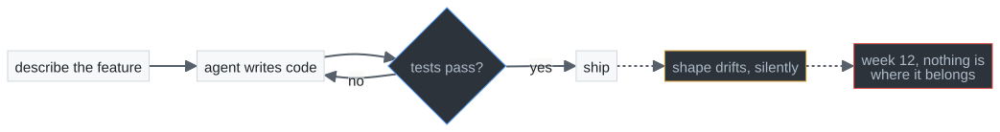
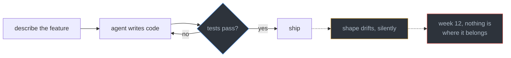
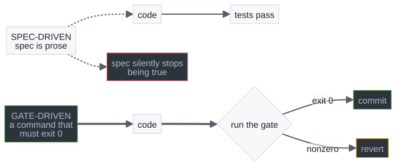
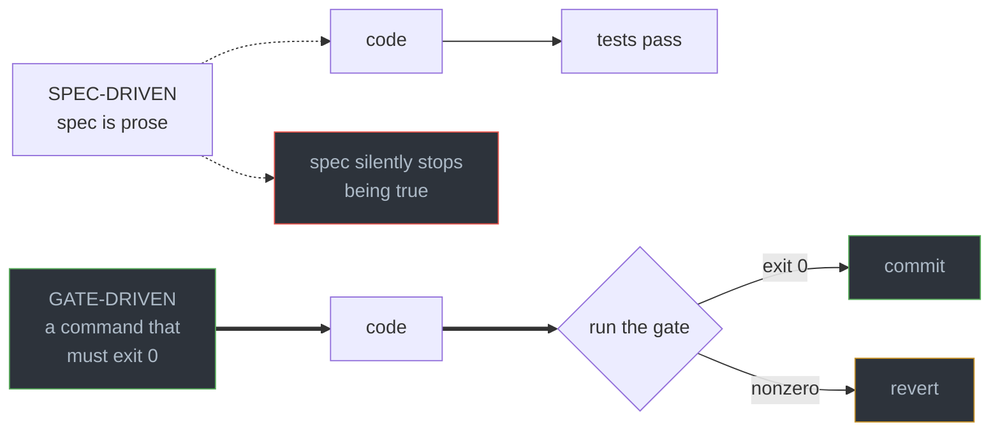
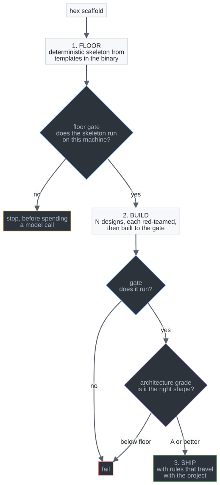
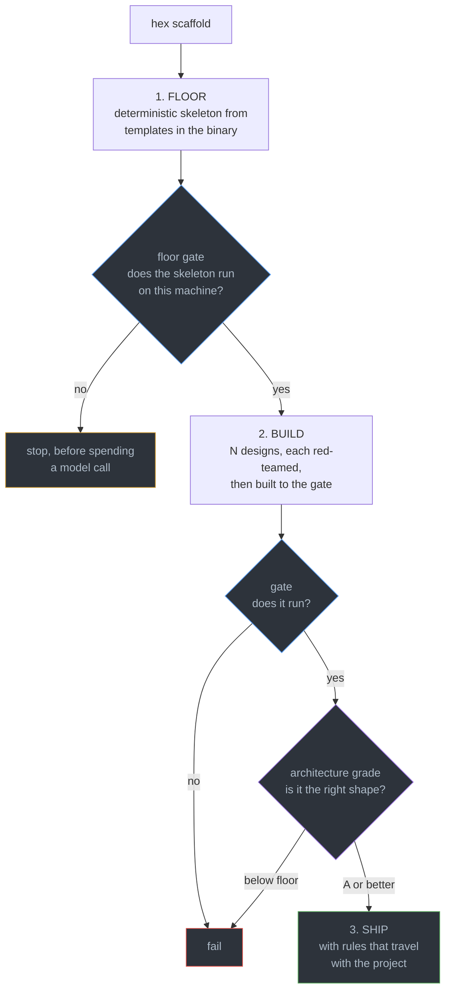
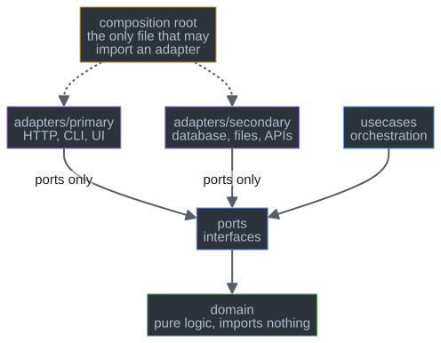
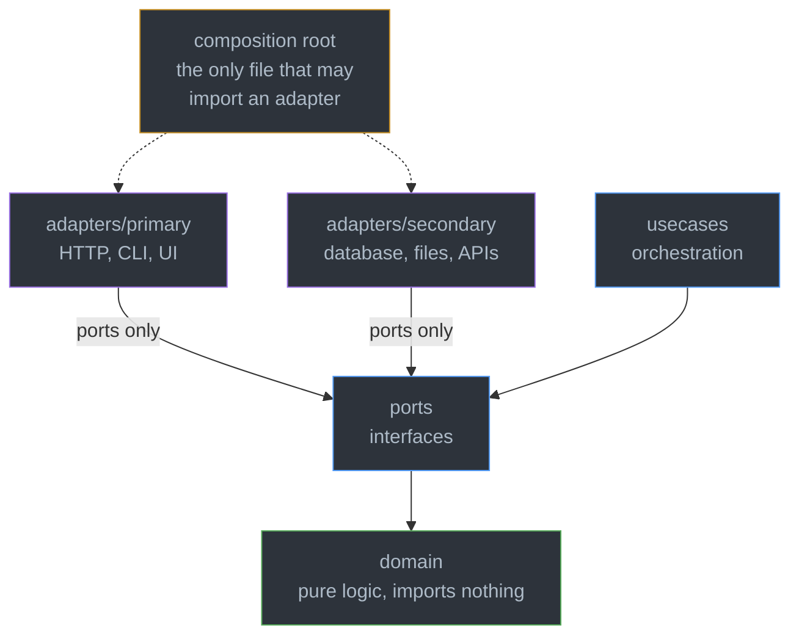

<p align="center">
  
</p>

<p align="center">
  <a href="https://www.rust-lang.org/"></a>
  <a href="LICENSE"></a>
  
  
  <a href="#limits"></a>
</p>

<p align="center">
  <strong>A scaffolding system for hexagonal projects, in one binary.</strong><br>
  An AI writes the code. Two gates decide whether it counts:<br>
  a command that must exit 0, and an architecture grade that must hold.
</p>

<p align="center">
  <a href="#the-problem">The problem</a> &middot;
  <a href="#quick-start">Quick start</a> &middot;
  <a href="#why-hexagonal">Why hexagonal</a> &middot;
  <a href="#limits">Limits</a>
</p>

---

## The problem

Generating code stopped being the bottleneck. Checking it didn't.

An AI agent will produce a working feature in minutes. What it will *also* do,
reliably, is produce a feature whose tests pass and whose shape is wrong. A use
case imports a database driver. A domain type depends on an HTTP client. Nothing
fails. The suite is green. The next change is a little harder, and the one
after that is harder still.

<p align="center">
  
</p>

<details>
<summary>diagram source</summary>


```mermaid
flowchart LR
    A["describe the feature"] --> B["agent writes code"]
    B --> C{"tests pass?"}
    C -->|"no"| B
    C -->|"yes"| D["ship"]
    D -.-> E["shape drifts, silently"]
    E -.-> F["week 12, nothing is<br/>where it belongs"]

    style C fill:#2d333b,stroke:#539bf5,color:#adbac7
    style E fill:#2d333b,stroke:#c69026,color:#adbac7
    style F fill:#2d333b,stroke:#e5534b,color:#adbac7
```

</details>

A test suite answers *does it run*. Nothing in that loop answers *is it still the
system I designed*.

### Why spec-driven development doesn't close it

The common answer is to write the spec first and have the agent implement it. That
moves the problem rather than solving it, for one structural reason:

> **A spec is prose. Prose cannot fail.**

Code drifts from a spec in silence, because nothing ever runs the spec. In a
110-spec corpus we audited, **44 described features that had already been deleted**.
Not one raised an error, ever. A document that cannot fail is indistinguishable
from a document that is wrong, and you cannot tell which one you are holding.

<p align="center">
  
</p>

<details>
<summary>diagram source</summary>


```mermaid
flowchart LR
    S1["SPEC-DRIVEN<br/>spec is prose"] -.-> S2["code"]
    S2 --> S3["tests pass"]
    S1 -.-> S4["spec silently stops<br/>being true"]

    G1["GATE-DRIVEN<br/>a command that<br/>must exit 0"] ==> G2["code"]
    G2 ==> G3{"run the gate"}
    G3 -->|"exit 0"| G4["commit"]
    G3 -->|"nonzero"| G5["revert"]

    style S4 fill:#2d333b,stroke:#e5534b,color:#adbac7
    style G1 fill:#2d333b,stroke:#57ab5a,color:#adbac7
    style G4 fill:#2d333b,stroke:#57ab5a,color:#adbac7
    style G5 fill:#2d333b,stroke:#c69026,color:#adbac7
```

</details>

A gate is executable, so it fails the moment it stops being true. That is the whole
difference, and it is why hex has no spec step.

---

## What hex does

Two gates, because they answer different questions.

<p align="center">
  
</p>

<details>
<summary>diagram source</summary>


```mermaid
flowchart TB
    A["hex scaffold"] --> B["1. FLOOR<br/>deterministic skeleton from<br/>templates in the binary"]
    B --> C{"floor gate<br/>does the skeleton run<br/>on this machine?"}
    C -->|"no"| X["stop, before spending<br/>a model call"]
    C -->|"yes"| D["2. BUILD<br/>N designs, each red-teamed,<br/>then built to the gate"]
    D --> E{"gate<br/>does it run?"}
    E -->|"no"| Y["fail"]
    E -->|"yes"| F{"architecture grade<br/>is it the right shape?"}
    F -->|"below floor"| Y
    F -->|"A or better"| G["3. SHIP<br/>with rules that travel<br/>with the project"]

    style C fill:#2d333b,stroke:#539bf5,color:#adbac7
    style E fill:#2d333b,stroke:#539bf5,color:#adbac7
    style F fill:#2d333b,stroke:#986ee2,color:#adbac7
    style G fill:#2d333b,stroke:#57ab5a,color:#adbac7
    style X fill:#2d333b,stroke:#c69026,color:#adbac7
    style Y fill:#2d333b,stroke:#e5534b,color:#adbac7
```

</details>

**The floor is not generated.** It comes from templates compiled into the binary.
The output is byte-identical on every machine, every run. A scaffold you cannot reproduce is not a
foundation, it is a draft. Its gate runs *before* any model call, because a skeleton
that will not build on your machine makes everything measured after it meaningless.

**The second gate is the one that is usually missing.** A test suite will happily
pass a program whose use case imports a database driver. `hex analyze` grades the
boundaries, and `hex scaffold --grade A` fails the build when the grade is not
earned.

**Rules travel with the project.** Every scaffold ships a `.hex/ADR-rules.toml` that
`hex analyze` runs from then on. The scaffold is not a starting point you leave
behind; it is the contract the project keeps being measured against.

---

## Why hexagonal

Because it is the one architecture whose rules are *mechanically checkable*. "Good
separation of concerns" cannot be graded. This can:

<p align="center">
  
</p>

<details>
<summary>diagram source</summary>


```mermaid
flowchart TB
    PA["adapters/primary<br/>HTTP, CLI, UI"]
    SA["adapters/secondary<br/>database, files, APIs"]
    U["usecases<br/>orchestration"]
    P["ports<br/>interfaces"]
    D["domain<br/>pure logic, imports nothing"]
    CR["composition root<br/>the only file that may<br/>import an adapter"]

    PA -->|"ports only"| P
    SA -->|"ports only"| P
    U --> P
    P --> D
    CR -.-> PA
    CR -.-> SA

    style D fill:#2d333b,stroke:#57ab5a,color:#adbac7
    style P fill:#2d333b,stroke:#539bf5,color:#adbac7
    style U fill:#2d333b,stroke:#539bf5,color:#adbac7
    style PA fill:#2d333b,stroke:#986ee2,color:#adbac7
    style SA fill:#2d333b,stroke:#986ee2,color:#adbac7
    style CR fill:#2d333b,stroke:#c69026,color:#adbac7
```

</details>

Every arrow points inward, and `hex analyze` walks the AST to check it. The rules are
short enough to state and strict enough to fail:

| # | Rule |
|---|---|
| 1 | `domain/` imports only `domain/` |
| 2 | `ports/` imports `domain/` only |
| 3 | `usecases/` imports `domain/` + `ports/` only |
| 4 | adapters import `ports/` **only**, never the domain directly |
| 5 | adapters never import other adapters |
| 6 | the composition root is the only file that imports an adapter |

Rule 4 is the one implementations break. An adapter that needs a domain type gets it
because the **port re-exports it**. Every adapter then has exactly one edge into
the core, and swapping a database means touching one file.

**Why this beats a linter.** A style rule tells you a line is ugly. These tell you a
*dependency* is wrong, which is the thing that makes a codebase expensive to change.
And because it is a graph property rather than a matter of taste, a number falls out
of it. That number is what lets it be a gate instead of a suggestion.

---

## Quick start

```bash
cargo build -p hex-cli --release
hex bootstrap                       # prerequisites, inference server, config
```

**Scaffold**

```bash
# the floor alone: deterministic, runnable, carries its own rules
hex init ./myapp --scaffold --lang rust

# the floor plus what you described, gated on the build AND the grade
hex scaffold "A bookmark service: SQLite store, HTTP API, tag search" \
  --target ./myapp --lang rust --grade A
```

```
✓ 8 files (rust) — gate: cargo test
✓ floor gate green: cargo test
✓ 2 designs → 2 critiques → build GREEN
✓ gate re-run: PASS — 27 test(s) ran
✓ architecture grade: A+ — score 100/100 (floor A)
```

**Grow it**

```bash
hex build "<subsystem>" --target <dir> --gate "<cmd>" --harden
hex do run "<task>" --file <f> --evidence "<cmd>"
hex harden <path> --gate "<cmd>"
```

`hex do` edits, runs your command, and commits **only if it exits 0**. Otherwise the
edit is reverted. A model that wanders commits nothing.

**Keep it honest**

```bash
hex analyze .                       # architecture grade + rule violations
hex graph consumers <path>          # who depends on this, before you delete it
```

Rust, Go and TypeScript. `hex --help` lists all 26 verbs.

---

## Does it work

Six projects, each from a single sentence, every gate re-run independently from a
clean build:

| Project | Lang | Tests | |
|---|---|---:|---|
| [`linkstore-svc`](examples/linkstore-svc) | Rust | 27 | HTTP + SQLite + migration; **12 end-to-end** against a live port and a real file on disk |
| [`game-2048-ts`](examples/game-2048-ts) | TS | 88 | |
| [`url-shortener-rs`](examples/url-shortener-rs) | Rust | 39 | |
| [`game-life-rs`](examples/game-life-rs) | Rust | 36 | |
| [`ratelimiter-proof`](examples/ratelimiter-proof) | Rust | 18 | |
| [`game-ttt-go`](examples/game-ttt-go) | Go | ✓ | |

**The tests were falsified before being believed.** Breaking the HTTP status in
`linkstore-svc` failed 4 tests; breaking a domain rule failed 3 more; restoring
returned 27/0. A passing test proves nothing until you have watched it fail.

**The second gate earned its keep there.** With a live database and a live listener,
the shortcut is a use case reaching for the driver. It didn't:

```
src/usecases/  →  crate::domain, crate::ports, std::sync::Arc
```

**Adversarial review finds what tests miss.** `hex harden` read a comment on the rate
limiter claiming `u128` cannot overflow on a product of two `u64`s. `Duration::as_nanos`
returns a `u128`. The product overflows, a cast truncates it, and the result is a
rate limiter that silently limits nothing. All 14 tests passed. A spec would not have caught it either,
because the intent was correct; only an adversary reading the code finds it.

**Changing code it did not write.** Against a 1,685-file project, ten single-token
bugs injected into ten files: **10/10 repaired**, each restoring the original line
exactly, zero test files edited.

---

## Limits

**Localisation.** hex repairs unfamiliar code only when you tell it which file. Given
just a failing test name it found the right file **once in ten**. Finding the bug is
the half that matters when you point a tool at a codebase, and it is the half that
does not work yet.

**Third-party imports in `domain/`.** Rule 1 says domain imports only domain. The
analyzer checks layer-to-layer edges and does not check that, so a project can pull a
runtime into its domain and still score A+. The headline rule is stricter than what is
enforced.

**The code generation is a frontier model.** hex contributes the deterministic floor,
the gates, the grade and the adversary. It does not do the writing. It turns a
capable model into a disciplined one. It does not replace it.

**Local models have a ceiling, and it depends on your language.** The same task, per
model, pass rate:

| Model | Rust | TS | Go |
|---|---|---|---|
| devstral-small-2:24b | 5/5 | 3/3 | 2/3 |
| gemma3:12b | 4/5 | 2/3 | 1/3 |
| qwen2.5-coder:14b | 0/5 | **2/3** | 0/3 |
| gpt-oss:20b | 0/5 | **1/3** | 0/3 |

TypeScript is forgiving; Rust and Go are strict, and weaker models fall off a cliff in
both. The top-of-the-leaderboard local model scored **last** on this grid.
Leaderboard rank does not predict agentic-loop performance. So hex runs best-of-N across a
complementary pair and falls back to a frontier model, with the gate picking the
winner. Measure your own with `hex bench agentic`.

---

## Architecture

Eight crates, one binary, ~53k lines. No daemon, no database, nothing to start.

| Crate | Role |
|---|---|
| **hex-core** | Contract surface. Zero runtime dependencies |
| **hex-infer** | Inference adapters, endpoint registry, tier resolution. The only place a provider or model may be named |
| **hex-exec** | The agent loop, best-of-N, the frontier delegate, the adversarial harness, guarded tools |
| **hex-analysis** | Tree-sitter boundary checking and health detectors. The grader |
| **hex-graph** | Code knowledge graph |
| **hex-git** &middot; **hex-parser** | git plumbing &middot; parsing |
| **hex-cli** | The binary, and the only composition root |

hex obeys its own rules: **A+ / 100 / 0 boundary violations**, 977 tests.

All state is files: `~/.hex/*.jsonl`, `.hex/project.json`, `graph-out/graph.json`.
Full map in [ARCHITECTURE.md](ARCHITECTURE.md); decisions in the append-only
[ADR ledger](docs/adrs/INDEX.md).

---

<p align="center">
  <sub>Operating rules: <a href="CLAUDE.md">CLAUDE.md</a> &middot; Every number here is
  reproducible from the gates in <code>examples/</code> and the reports in
  <code>docs/analysis/</code>.</sub>
</p>
