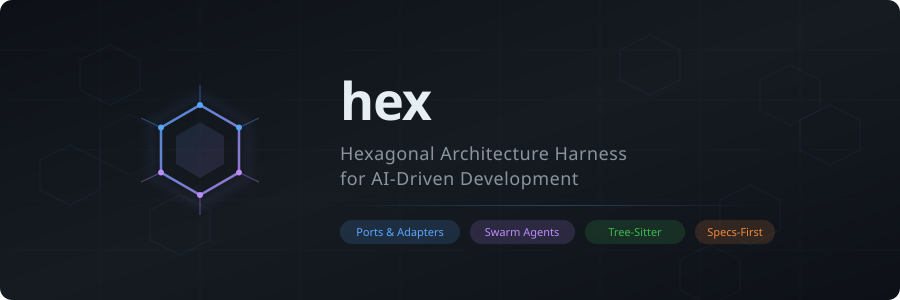

<p align="center">
  
</p>

<p align="center">
  <a href="https://www.rust-lang.org/"></a>
  <a href="LICENSE"></a>
  <a href="docs/adrs/INDEX.md"></a>
  <a href="#where-hex-actually-is"></a>
</p>

<p align="center">
  <strong>An AI Operating System built on hexagonal architecture.</strong><br>
  A single evidence-gated agent loop for bounded work — and a cooperative+adversarial agent harness
  that designs and hardens whole systems. Hybrid inference: local models first, a
  <code>claude -p</code> frontier path for the hard parts.
</p>

<p align="center">
  <a href="ARCHITECTURE.md">Architecture</a> ·
  <a href="docs/adrs/INDEX.md">ADR ledger</a> ·
  <a href="docs/benchmarks/">Benchmarks</a>
</p>

---

> **Status (2026-06, `hybrid-inference` epoch).** hex is a working substrate with a real, measured
> execution model. An earlier design (the retired `org-sim` epoch) modeled development as a simulated
> *organization of personas*; that was collapsed to one strong loop. The multi-agent goal then came
> **back, earned**: a disciplined [cooperative+adversarial harness](#the-agentic-harness) anchored on
> a ground-truth test gate — which has built three real systems from one-line specs. What follows is
> what hex does today.

## What hex is

hex is a microkernel-based **AI Operating System (AIOS)** built on **hexagonal architecture**
(Ports & Adapters). It installs *into* a target project to orchestrate AI-driven development:
**agents are the users, developers are the sysadmins.** Hooks, skills, agents, and settings are
instantiated into the target project; `examples/` holds sample targets.

The differentiator is **the quality of context assembled for one agent loop** — code-graph
relevance plus ranked lessons — not a head-count of simulated personas.

## The execution model

The canonical path is `hex do` → an evidence-gated **ReAct loop** (reason → act → observe →
repeat) over a curated, guarded toolset (read/verify tools + a terminal `propose_edit`; no
arbitrary shell). The whole loop lives in the **`hex-exec`** crate.

```
task + graph context + ranked lessons
  → reason → read/verify tools → propose_edit → run evidence command
  → commit IFF it exits 0   (else revert; the gate is the sole authority on what commits)
```

What's actually wired (all shipped + validated — see the ADR ledger):

- **The evidence gate** is the only thing that authorizes a commit — vacuous passes rejected,
  failed edits reverted atomically. No "it compiles" theater.
- **Per-run worktree isolation** — autonomous runs execute in a dedicated `hex/auto/<id>`
  worktree, hard-guarded against the operator's tree (ADR-2606071323).
- **Evidence-gated best-of-N across complementary models** — `hex do` tries an ordered candidate
  list and commits the first to pass the gate. The gate, not a classifier, picks the winner
  (ADR-2606072044).
- **`claude -p` frontier fallback** — when local models fail, a `claude-code` candidate delegates
  the whole task to the operator's logged-in Claude CLI: no API key, no VRAM ceiling. Local runs
  free/fast; Claude recovers the hard ones.
- **Benchmark-driven model choice** — `hex bench agentic` runs fixtures through the *real* loop
  and scores per-model pass-rates (`docs/benchmarks/`).
- **Self-deploy** — `hex dev deploy` builds, installs, and restarts in one command.
- **Hex-native frontier swarm** — `hex swarm run` fans a task list out to parallel `claude -p`
  workers under a supervisor (semaphore-bounded). hex orchestrates its own agents.

## The agentic harness

The single loop above is for *bounded* work. For whole systems, hex has a **cooperative+adversarial
harness** — multiple `claude -p` agents that disagree, attack each other's work, and resolve against
a ground-truth gate. Two composable verbs:

- **`hex swarm build '<challenge>' --target <dir> --gate '<test>'`** — *cooperative design*: N agents
  propose divergent designs (durability-first, concurrency-first, …) → each is red-teamed →
  synthesized into one spec → built until the gate passes.
- **`hex swarm review <path> --gate '<test>'`** — *adversarial hardening*: parallel reviewers hunt
  bugs by failure-class lens → each finding is skeptically verified (default-refute) → confirmed bugs
  are fixed under the gate.
- `--review` chains them: `hex swarm build … --review` runs the full pipeline.

What makes it *real*, not org-sim theater: **a ground-truth test gate is the only authority**, the
verifier defaults to *refuting* findings (so plausible-but-wrong bugs die before any edit), and the
agents are frontier `claude -p` workers, not local personas.

**Proven** — from one-line challenges, the harness built three real systems, and the adversarial pass
found bugs the builds' *own passing tests* missed:

| System (built from a one-line spec) | LOC | Adversarial review found |
|---|---|---|
| Concurrent durable job queue (WAL, crash-recovery) | ~2900 | **6 real bugs** (incl. silent WAL data-loss) |
| Thread-safe LRU + TTL cache | ~1300 | **1 real bug** (exception-safety) |
| Token-bucket rate limiter | ~550 | **0** (clean by design) |

The 6 / 1 / 0 spread is the signature of a real tool — it finds bugs when they're there and reports
none when they're not. hex supplies the structure that makes it work: the divergent-design pipeline,
the skeptical-verify gate, the fix-loop, and the evidence anchor — orchestrating `claude -p` agents
into a disciplined build-and-harden pipeline you can point at a one-line spec and get tested,
architecturally-clean code back.

## What hex can do today

Concretely, with the receipts:

**What works:**
- The hexagonal architecture is real and self-enforced — `hex analyze` grades the workspace
  **A+ / 0 boundary violations** (hex passes its own analyzer).
- The evidence-gated loop genuinely produces real, tested, committed code, and the gate holds
  under failure (a wandering model commits *nothing*).
- Best-of-N + the `claude -p` fallback let the loop recover across models automatically —
  validated live (a local model failed a task; Claude took over and committed).
- The **cooperative+adversarial harness** builds *and* hardens whole systems from one-line specs —
  proven on three (job queue, cache, rate limiter), each gated by its own tests, with the
  adversarial pass catching real bugs the build missed. hex even used it to find a bug in its *own*
  output.

**The honest envelope:**
- **The full capability above runs on a frontier API or a logged-in `claude` CLI.** Strictly local
  on commodity hardware has a ceiling (see the next section) — there, the local loop is a reliable
  implementer of bounded work, and the frontier path takes the whole-system design and the hardest
  tasks. hex routes between them by *measured fit*, not by guessing.
- The benchmark corpus is small; treat any single number as directional, not gospel.

## Local AI: the honest picture

hex is model-agnostic (Ollama, vLLM, OpenAI-compatible, Claude). But the *agentic loop* —
multi-turn tool use, not single-shot codegen — is demanding, and we measured it:

- **It's a RAM problem, not just a VRAM one.** Top open models are large MoEs (e.g.
  Qwen3-Coder-Next is ~51 GB of weights); on a 16 GB-GPU / 30 GB-RAM box they don't fit, even with
  offload. The reachable set is ~≤13 GB-resident models.
- **No single local model dominates.** A benchmark across the reachable models reordered the
  "best" model on *every* fixture — devstral leads on string tasks, qwen on algorithmic ones, and
  the top-of-the-leaderboard local model scored *last* on our grid. **Leaderboard scores do not
  predict agentic-loop performance.**
- **The *language* matters as much as the model.** We ran the *same* CSV-parser task in Rust, TS,
  and Go (react, per-model pass rate):

  | Model | Rust | TS | Go |
  |---|---|---|---|
  | qwen2.5-coder:14b | 0/5 | **2/3** | 0/3 |
  | gpt-oss:20b | 0/5 | **1/3** | 0/3 |
  | devstral-small-2:24b | 5/5 | 3/3 | 2/3 |
  | gemma3:12b | 4/5 | 2/3 | 1/3 |

  The lesson isn't "static typing is hard" — it's that **TypeScript is uniquely *forgiving*, while
  Rust *and* Go are strict and hard for weaker local models.** The two models that recover in TS
  (qwen, gpt-oss) crash right back to 0/3 in Go — Go's strictness (unused imports/vars are compile
  errors, byte-vs-rune) punishes them almost like Rust's borrow checker. So the local ceiling — and
  how much the `claude -p` fallback is load-bearing — depends heavily on your language: lowest for
  TS/JS, high for Rust and Go.
- **So hex doesn't bet on one model.** It runs best-of-N across a complementary pair and falls
  back to `claude -p` for tasks locals can't finish. That's the honest path to reliability on this
  hardware — most so for Rust, less needed for TS.

If you have a frontier API or a logged-in `claude` CLI, hex is strong. If you're strictly local on
commodity hardware, hex works but inherits the local models' ceiling — and the benchmark tells you
exactly where that is.

## Architecture

Full detail in **[ARCHITECTURE.md](ARCHITECTURE.md)** (the living map; always describes HEAD). The
Rust workspace:

| Crate | Role |
|---|---|
| **hex-core** | Domain types + all port traits (zero deps) |
| **hex-exec** | The single-agent loop: ReAct, best-of-N, `claude -p` delegate, guarded tools |
| **hex-graph** | Code-knowledge-graph engine → `graph-out/graph.json` |
| **hex-analysis** | Tree-sitter boundary checking; powers `hex analyze` |
| **hex-git** / **hex-state** | git plumbing · SpacetimeDB state adapter |
| **hex-nexus** | Composition root + daemon (axum `:5555`, dashboard, DI) |
| **hex-cli** | The canonical `hex` entry point |

**SpacetimeDB** (required) is the coordination/state core; WASM can't touch FS/spawn/network, so
**hex-nexus** is the FS-bridge daemon.

## Quick start

```bash
hex bootstrap          # prerequisites, SpacetimeDB, Ollama (if present), config
hex nexus start        # the daemon (dashboard at :5555)
hex do run --file <f> --evidence "<cmd that must exit 0>" "<what to do>"
hex bench agentic --filter <fixture>   # measure a model through the real loop
hex dev deploy         # rebuild + install + restart, one command
hex analyze .          # architecture grade + boundary violations
```

## Governance

- **ADRs are an append-only ledger** — decisions are never edited or deleted; a changed decision
  gets a new ADR that supersedes the old one. Lifecycle: `Proposed → Accepted → Completed`, or
  `Rejected | Abandoned | Superseded | Deprecated`.
- **Epochs** group ADRs by design era (`foundation` → `org-sim` *(retired)* → `single-agent` →
  **`hybrid-inference`** *(current)*). `hex adr reindex` regenerates the [INDEX](docs/adrs/INDEX.md).
- **ARCHITECTURE.md is the living map**; the ADR ledger is its history.

## Influences & attestation

The **`hex-graph`** code-knowledge engine is **graphify-influenced** — a GraphRAG-style code graph
(typed nodes + edges, community detection, `EXTRACTED`/`INFERRED`/`AMBIGUOUS` confidence levels)
reimplemented natively in Rust. The single-agent execution model (one gateway-mediated ReAct loop
fed by code-graph context + memory, ADR-2606061359) converges with ideas from **OpenClaw** and
**Hermes Agent** (Nous Research). These shaped the design; the implementation is hex's own.

---

*Operational rules (how to drive hex day-to-day) live in [CLAUDE.md](CLAUDE.md). The architecture
map is [ARCHITECTURE.md](ARCHITECTURE.md).*
