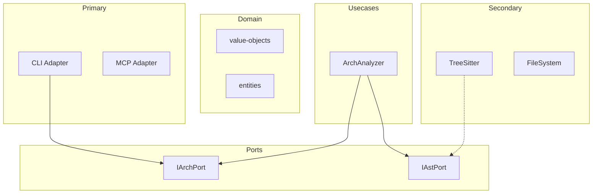

# Dashboard & Swarm System Analysis

## Executive Summary

The hex dashboard system is architecturally sound — a hub-and-spoke daemon on port 5555 with HTTP push, SSE streaming, and WebSocket topics. However, the current implementation is **terminal-first** with a 67KB monolithic HTML file and no external API authentication. This analysis identifies what matters most to developers, what's missing, and recommends an external web experience for managing project swarms.

---

## 1. What Developers Need Most

### The Developer Mental Model (Priority Order)

| Priority | Question | Current Answer | Gap |
|----------|----------|---------------|-----|
| **P0** | "Is my architecture healthy?" | Health score 0-100, A-F grade | No trend over time |
| **P0** | "What broke and where?" | Violation list with layer names | No clickable source navigation |
| **P1** | "What are my agents doing?" | Swarm tab: agent grid with status | No task dependency visualization |
| **P1** | "How do layers depend on each other?" | D3 force graph | Too abstract — needs layer grouping |
| **P2** | "What changed since last commit?" | File watcher events in log | No diff-aware analysis |
| **P2** | "Where is dead code accumulating?" | Dead export list | No historical trend or heatmap |
| **P3** | "How token-efficient is my context?" | Token tab with L1/L3 ratios | Hard to interpret — needs budget view |

### The Critical Developer Insight

**Developers don't want dashboards — they want answers.** The most valuable view isn't a collection of metrics; it's a **single actionable summary**:

> "Your architecture scores 87/100 (B+). 2 boundary violations in `adapters/primary/` importing from `adapters/secondary/`. 3 dead exports accumulating in `domain/`. Swarm: 4 agents active, port adapter blocked (quality regression detected, 2 iterations without improvement). Recommended: fix violations first, they affect 12 downstream imports."

This narrative doesn't exist today. The data is there but spread across 5 tabs.

---

## 2. What's Missing (Ranked by Developer Impact)

### Tier 1: High Impact, Moderate Effort

#### 1.1 Architecture Narrative Engine
- **What**: Auto-generated natural language summary combining health, violations, dead code, and swarm status into one paragraph
- **Why**: Developers open dashboards for ~5 seconds. If the answer isn't immediately visible, they close it
- **Where**: New usecase `NarrativeGenerator` consuming `ArchAnalysisResult` + swarm status

#### 1.2 Dependency Graph with Layer Grouping
- **What**: Replace flat force-directed graph with **layered Sankey/swimlane** showing domain→ports→usecases→adapters
- **Why**: Current D3 graph is visually interesting but architecturally meaningless — nodes cluster by proximity, not by layer
- **Where**: Dashboard graph tab, new visualization mode

#### 1.3 Violation Drill-Down with Source Links
- **What**: Click a violation → see the exact import line, the rule broken, and a suggested fix
- **Why**: Going from "violation in X" to "open file, find line, understand rule" takes 30+ seconds per violation
- **Where**: Dashboard health tab, expandable violation cards

#### 1.4 Swarm Task Dependency DAG
- **What**: Visual DAG showing task dependency tiers (domain→ports→secondary→primary→usecases) with real-time progress
- **Why**: Understanding "why is my agent waiting?" requires knowing the dependency chain
- **Where**: Dashboard swarm tab, new DAG overlay

### Tier 2: High Impact, Higher Effort

#### 2.1 External Web UI (Non-Terminal)
- **What**: Standalone web application (React/Next.js or Vite SPA) consuming the existing HTTP/SSE API
- **Why**: See Section 3 below — the terminal dashboard has fundamental UX limitations
- **Where**: New package `@hex/dashboard-web` or `hex-dashboard/` directory

#### 2.2 Health Score Trend Line
- **What**: Store health scores per commit hash, render as sparkline/trend chart
- **Why**: "Is my architecture getting better or worse?" requires temporal data
- **Where**: New secondary adapter (SQLite or JSON file), dashboard health tab

#### 2.3 Diff-Aware Analysis
- **What**: Run `hex analyze` on git diff rather than full project, showing only new/changed violations
- **Why**: On large projects, the full report is noise; developers want "what did I just break?"
- **Where**: New `analyzeIncrementally(baseSha, headSha)` method on ArchAnalyzer

### Tier 3: Nice to Have

#### 2.4 Mermaid/DOT Graph Export
- **What**: `hex graph --format mermaid|dot` for embedding in docs/PRs
- **Why**: Architecture diagrams in PRs catch violations before merge
- **Where**: New report-formatter output mode

#### 2.5 Token Budget Visualizer
- **What**: Show token usage as % of a configurable budget (e.g., "200K context window")
- **Why**: L1/L3 ratios are abstract; "you're using 47% of your context budget" is actionable
- **Where**: Dashboard tokens tab, budget bar overlay

#### 2.6 Notification Webhook Integration
- **What**: Send decision requests and milestone events to Slack/Discord/HTTP endpoints
- **Why**: When agents need human decisions, terminal-only notification is a bottleneck
- **Where**: New secondary adapter implementing `INotificationEmitPort`

---

## 3. External Web UI: Yes, Build It

### The Case For

The current dashboard has **4 fundamental limitations** that can't be solved in a terminal-embedded HTML page:

1. **Discovery**: Developers must know to run `hex dashboard` or have auto-start configured. A persistent web UI at a known URL (localhost:5555) is bookmarkable.

2. **Multi-project oversight**: The hub already supports multiple projects, but the terminal experience is per-project. A web UI can show a **project grid** — health scores across all registered projects at a glance.

3. **Interaction depth**: Terminal-served HTML can't support rich interactions like:
   - Drag-to-zoom on dependency graphs
   - Click-to-navigate to source (via VS Code URI scheme `vscode://file/...`)
   - Inline decision responses with context (instead of POST to SSE)
   - Persistent filter/sort preferences

4. **Collaboration**: A web UI can be shared (tunneled via ngrok/cloudflare) for team visibility into swarm progress during long-running builds.

### Recommended Architecture

```
┌─────────────────────────────────────────────────────────┐
│                    hex Dashboard Web                     │
│                                                         │
│  ┌──────────┐  ┌──────────┐  ┌──────────┐  ┌────────┐ │
│  │ Projects  │  │  Health   │  │  Swarm   │  │ Graph  │ │
│  │  Grid     │  │ Narrative │  │ Task DAG │  │ Layers │ │
│  └─────┬────┘  └─────┬────┘  └─────┬────┘  └───┬────┘ │
│        └──────────────┴──────────────┴───────────┘      │
│                         │                                │
│              EventSource (SSE) + fetch()                 │
│                         │                                │
└─────────────────────────┼───────────────────────────────┘
                          │
              ┌───────────┴───────────┐
              │    DashboardHub       │
              │    localhost:5555     │
              │                       │
              │  GET /api/projects    │
              │  GET /api/:id/health  │
              │  GET /api/:id/swarm   │
              │  GET /api/:id/graph   │
              │  GET /api/events (SSE)│
              │  WS  /ws             │
              └───────────┬───────────┘
                          │
          ┌───────────────┼───────────────┐
          │               │               │
     Project A       Project B       Project C
     (hex client)    (hex client)    (hex client)
```

### Implementation Approach

**Option A: Vite SPA** (recommended for hex ecosystem)
- Lightweight, ships as part of `hex` npm package
- Served by DashboardHub alongside current index.html
- Route: `/app/` for SPA, `/` for legacy embedded view
- Tech: Preact + D3.js (minimal bundle, <100KB)

**Option B: Standalone Next.js app**
- Separate package, more features (SSR, API routes)
- Overkill for local-first dev tool
- Better if hex becomes a team/cloud product

**Recommendation**: Option A. The hub already serves static files — add a `/app/` route with a modern SPA. Keep the monolithic `index.html` as fallback for minimal environments.

### API Gaps for External UI

The current API is mostly sufficient but needs:

| Gap | Current | Needed |
|-----|---------|--------|
| **Authentication** | Token in lock file only | Optional API key header for remote access |
| **CORS** | Not configured | Add `Access-Control-Allow-Origin` for dev |
| **History endpoint** | None | `GET /api/:id/health/history` for trend data |
| **Narrative endpoint** | None | `GET /api/:id/narrative` for auto-summary |
| **Graph formats** | JSON only | `?format=mermaid` query param |
| **Decision UI** | SSE-based | REST `POST /api/:id/decisions/:id/respond` |

---

## 4. Best Way to Visualize Architecture

### Current: Force-Directed Graph (D3.js)

**Strengths**: Shows all nodes and edges, interactive physics
**Weakness**: No semantic layout — domain files might appear next to adapter files by accident

### Recommended: Multi-Mode Visualization

#### Mode 1: Layer Swimlane (Default View)
```
┌─────────────────────────────────────────────────┐
│                 DOMAIN LAYER                     │
│  ┌──────────┐  ┌──────────┐  ┌──────────┐     │
│  │ entities │  │  value-   │  │  events  │     │
│  │          │  │  objects  │  │          │     │
│  └────┬─────┘  └────┬─────┘  └──────────┘     │
├───────┼──────────────┼──────────────────────────┤
│       │    PORTS     │    LAYER                  │
│  ┌────▼─────┐  ┌────▼─────┐                    │
│  │ IArch    │  │ IAst     │                    │
│  │ Port     │  │ Port     │                    │
│  └────┬─────┘  └────┬─────┘                    │
├───────┼──────────────┼──────────────────────────┤
│       │  USE CASES   │                           │
│  ┌────▼─────────────▼──┐                        │
│  │  ArchAnalyzer       │                        │
│  │  CodeGenerator      │                        │
│  └────┬────────────┬───┘                        │
├───────┼────────────┼────────────────────────────┤
│  PRIMARY           │  SECONDARY ADAPTERS         │
│  ADAPTERS          │                             │
│  ┌────▼─────┐  ┌──▼────────┐  ┌─────────────┐ │
│  │ CLI      │  │ TreeSitter│  │ FileSystem  │ │
│  │ MCP      │  │ Ruflo     │  │ Git         │ │
│  │ Dashboard│  │           │  │             │ │
│  └──────────┘  └───────────┘  └─────────────┘ │
└─────────────────────────────────────────────────┘
```

**Why**: Maps directly to hex architecture mental model. Violations are **visible as arrows crossing swimlanes in the wrong direction** (red dashed lines).

#### Mode 2: Dependency Heatmap
- Matrix view: files on X and Y axes, color = coupling strength
- Clusters reveal which files are tightly coupled
- Ideal for spotting hidden dependencies between adapters

#### Mode 3: Violation Overlay
- Same as Mode 1, but only shows violation edges (red) and circular deps (orange cycles)
- Clean view for "what do I need to fix?"

#### Mode 4: Mermaid Export (for docs/PRs)


### Rendering Technology

| Approach | Pros | Cons | Recommendation |
|----------|------|------|----------------|
| **D3.js** (current) | Full control, interactive | Heavy, complex code | Keep for force graph |
| **ELK.js** | Layered layout algorithm | Larger bundle | Best for swimlane mode |
| **Mermaid** | Zero JS in export, PR-friendly | Limited interactivity | Best for docs/CI |
| **Cytoscape.js** | Built-in layouts, plugins | Medium bundle | Good alternative to D3 |

**Recommendation**: Use **ELK.js** for the swimlane layout (it's designed for layered graphs) and keep D3 for the interactive force view. Add Mermaid export as a CLI option.

---

## 5. Data Collection Enhancements

### What to Collect That We Don't

| Data | Source | Value |
|------|--------|-------|
| **Health history per commit** | Store after each `hex analyze` | Trend lines, regression detection |
| **Agent decision log** | NotificationOrchestrator decisions | Post-mortem analysis, pattern learning |
| **Token budget utilization** | L1/L3 sums vs configurable limit | "You're at 67% of context budget" |
| **Build/test timing** | BuildAdapter execution times | Performance regression detection |
| **File change frequency** | File watcher aggregation | Hotspot detection (churn rate) |
| **Cross-project patterns** | AgentDB pattern aggregation | "Projects with >5 adapters tend to have 3x more violations" |

### Notification System Gaps

| Current | Missing |
|---------|---------|
| Terminal notifications | Webhook (Slack/Discord/HTTP) |
| SSE to dashboard | Email digest for long-running swarms |
| Decision requests with 30s timeout | Configurable timeout + escalation chain |
| Per-agent progress | Per-tier (dependency group) progress |

---

## 6. Implementation Roadmap

### Phase 1: Narrative + API Gaps (1-2 days)
- [ ] Add `NarrativeGenerator` usecase (combines health + swarm + violations into paragraph)
- [ ] Add `GET /api/:id/narrative` endpoint
- [ ] Add CORS headers to DashboardHub
- [ ] Add `?format=mermaid` to graph endpoint

### Phase 2: History + Trends (2-3 days)
- [ ] Add `HealthHistoryAdapter` (SQLite or JSON append-log)
- [ ] Store health score on each `hex analyze` run
- [ ] Add `GET /api/:id/health/history` endpoint
- [ ] Add sparkline chart to dashboard health tab

### Phase 3: Modern Web UI (3-5 days)
- [ ] Scaffold Vite SPA in `src/adapters/primary/dashboard-app/`
- [ ] Project grid view (all registered projects, health scores)
- [ ] Layer swimlane visualization (ELK.js)
- [ ] Swarm task DAG with real-time progress
- [ ] Violation drill-down with VS Code links
- [ ] Decision response UI

### Phase 4: External Integrations (2-3 days)
- [ ] Webhook notification adapter (Slack/Discord/HTTP)
- [ ] Mermaid graph export CLI command
- [ ] Token budget configuration and visualization
- [ ] File churn hotspot detection

---

## Appendix: Current System Map

### Files Analyzed
- `src/adapters/primary/dashboard-hub.ts` (484 lines) — Central hub daemon
- `src/adapters/primary/dashboard-adapter.ts` (296 lines) — Per-project client
- `src/adapters/primary/daemon-manager.ts` (226 lines) — Hub lifecycle
- `src/adapters/primary/ws-broker.ts` (504 lines) — WebSocket pub/sub
- `src/adapters/primary/notification-query-adapter.ts` (171 lines) — Notification facade
- `src/adapters/primary/dashboard/index.html` (67.5KB) — Monolithic UI
- `src/core/usecases/arch-analyzer.ts` — Architecture analysis engine
- `src/core/usecases/notification-orchestrator.ts` (607 lines) — Event→notification bridge
- `src/core/domain/report-formatter.ts` — Text report output
- `src/core/usecases/layer-classifier.ts` — 7 hex boundary rules
- `src/core/ports/index.ts` — All port interfaces
- `src/composition-root.ts` — DI wiring
- `src/adapters/primary/mcp-adapter.ts` — 18 MCP tools
- `agents/*.yml` — 5 agent definitions

### Data Flow Summary
```
Source Code → TreeSitter AST → L1 Summaries → ArchAnalyzer
  → ArchAnalysisResult { health, violations, deadCode, graph }
    → DashboardAdapter.pushHealth() → HTTP POST → DashboardHub
      → SSE broadcast → Dashboard UI (browser)
      → GET /api/:id/health → External consumers
```
