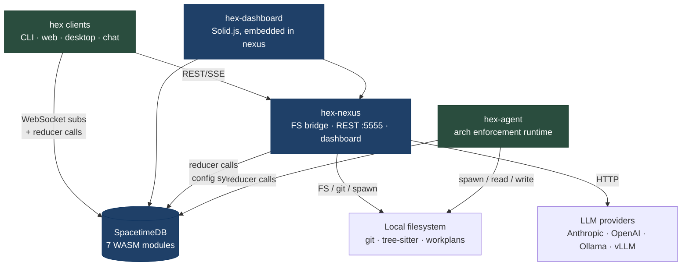
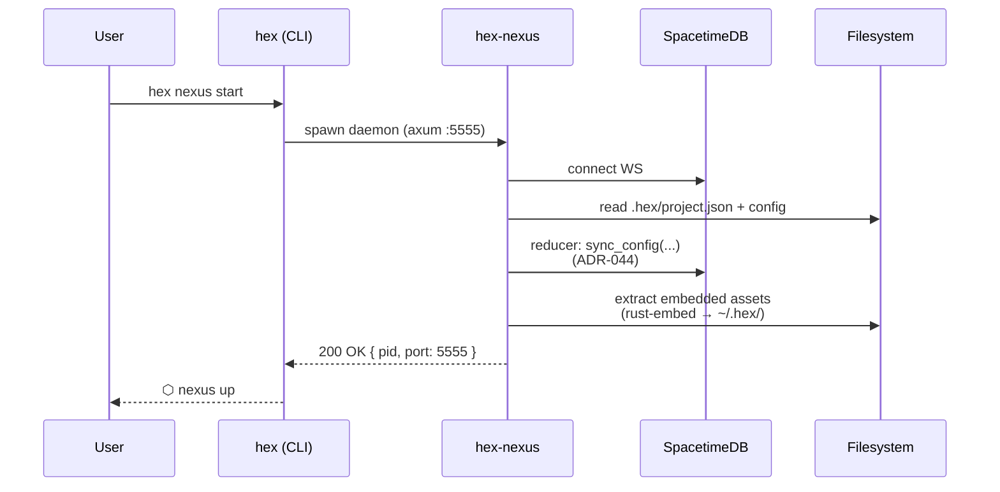
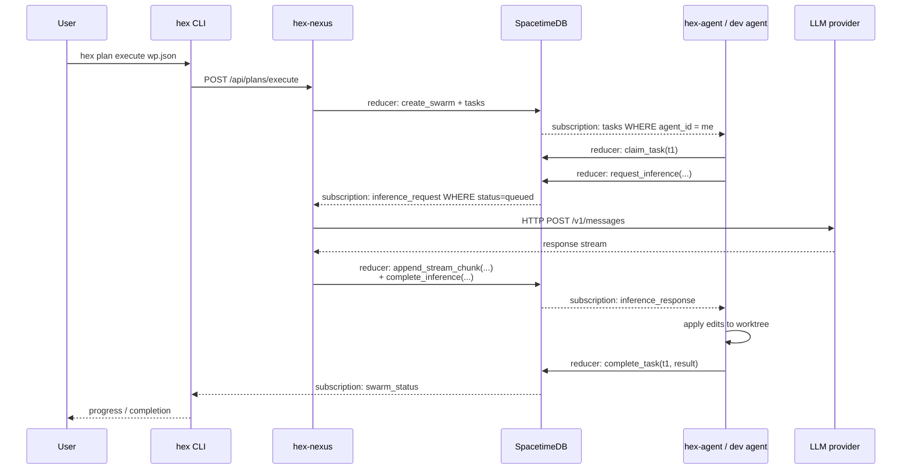

# hex System Architecture

> Authoritative overview of the 5 deployment units, their dependency graph, and the two canonical runtime flows (cold start, workplan execution). Companion to per-unit docs in `docs/reference/components/`.

This document is the long-form source-of-truth for "what runs where". `CLAUDE.md` is the model-facing kernel that points here for detail.

## What hex is

hex is a microkernel-based **AI Operating System (AIOS)** built on hexagonal architecture (Ports & Adapters). It is installed *into* a target project and orchestrates AI-driven development — agents are the users; developers are the sysadmins.

Everything in this repo (hooks, skills, agents, statuslines, settings) is instantiated into a target project. `examples/` contains sample targets that consume hex as a dependency.

## The 5 deployment units

| Unit | Lang | Required? | Purpose |
|------|------|-----------|---------|
| **SpacetimeDB** | Rust + WASM | yes | Coordination & state core. 7 server-side WASM modules in `spacetime-modules/`. All clients connect via WebSocket. |
| **hex-nexus** | Rust (axum) | yes | Filesystem bridge daemon. Runs the dashboard at `:5555`, exposes the REST API, syncs config → SpacetimeDB on startup, runs tree-sitter analysis, drives git. |
| **hex-agent** | Rust | on dev hosts | Architecture-enforcement runtime. Required on any host running hex dev agents — enforces hex rules via skills/hooks/ADRs/workplans. |
| **hex-dashboard** | Solid.js + Tailwind | yes (served by nexus) | Developer control plane. Multi-project, fleet, arch-health, inference monitoring. Real-time via SpacetimeDB subscriptions. Bundled into the nexus binary via `rust-embed`. |
| **hex clients** | various | varies | CLI (`hex`), web (dashboard), desktop (Tauri), chat (`hex-chat`). All connect to nexus + SpacetimeDB. |

**Why this split?** SpacetimeDB WASM modules cannot access the filesystem, spawn processes, or make network calls — that is *exactly* why hex-nexus exists. Anything that needs the OS (FS, git, HTTP to LLM providers, process spawning) flows through nexus.

## Dependency graph



**Edge legend:**
- *FS bridge*: nexus is the **only** unit that performs OS-level operations (filesystem, git, spawning, outbound HTTP).
- *WebSocket subs*: every client subscribes to SpacetimeDB tables for real-time updates. There is no polling.
- *reducer calls*: state mutations are transactional and go through WASM module reducers.

## Required services on a fresh host

```bash
# 1. SpacetimeDB (one-time install)
spacetime --version

# 2. hex-nexus daemon
hex nexus start                  # background-supervised
hex nexus status                 # PID, uptime, port

# 3. (optional) brain daemon for autonomous queue draining
hex brain daemon --background --interval 30
hex brain daemon-status
```

If any of {SpacetimeDB, hex-nexus} is down, all clients degrade. There is **no SQLite fallback path** — earlier ADRs proposed one (ADR-015) but ADR-025 mandates SpacetimeDB as the canonical backend.

## Standalone mode (ADR-2604112000)

When `CLAUDE_SESSION_ID` is unset, hex-nexus uses an `AgentManager` + `OllamaInferenceAdapter` composition — no Claude CLI, no Anthropic API key required. Tasks dispatch to local inference (Ollama / vLLM) via the same `inference-gateway` WASM module as Claude-mode.

Diagnostics:

```bash
hex doctor composition           # which composition variant is active
hex ci --standalone-gate         # validates the standalone path end-to-end
```

The composition variant is selected at nexus startup based on env vars — the wiring lives in `hex-nexus/src/composition.rs`.

## Tiered inference routing (ADR-2604120202 / ADR-2604131630)

Every inference request is tagged with a tier derived from the `WorkplanTask.strategy_hint`. The `inference-gateway` module and `inference-bridge` route to the configured model per tier; hex-nexus makes the actual outbound HTTP call.

| Tier | Default model | Strategy hints | Selection |
|------|---------------|----------------|-----------|
| T1 | `qwen3:4b` | `scaffold` · `transform` · `script` | best-of-N + compile gate |
| T2 | `qwen2.5-coder:32b` | `codegen` | best-of-N + compile gate |
| T2.5 | `devstral-small-2:24b` | `inference` | best-of-N + compile gate |
| T3 | Claude (frontier) | bypasses scaffolded dispatch | single-shot |

Per-tier overrides live in `.hex/project.json` → `inference.tier_models`. `hex inference escalation-report` shows what got promoted across tiers.

## Cold-start data flow



Key points:
1. nexus is the *only* unit that touches the filesystem on startup.
2. Config files (`.hex/project.json`, agent YAMLs, swarm YAMLs) are pushed into SpacetimeDB on startup so all clients see the same view.
3. Embedded assets (skills, agents, hooks, helpers) are extracted from the nexus binary into `~/.hex/` via `rust-embed`.

## Workplan execution data flow



Key invariants:
- All state transitions go through SpacetimeDB reducers (transactional).
- All outbound HTTP (LLM calls) goes through nexus.
- Agents never call LLM providers directly — they enqueue requests; nexus drains them.

## Repository layout

```
# Rust workspace (6 crates)
hex-cli/                 CLI binary — canonical user entry point
hex-nexus/               FS-bridge daemon + dashboard (axum, :5555)
  src/analysis/            Tree-sitter, boundary checking
  src/coordination/        HexFlo swarm coordination (ADR-027)
  src/adapters/            SpacetimeDB + SQLite state adapters
  src/config_sync.rs       Repo → SpacetimeDB sync (ADR-044)
  src/git/  src/orchestration/
  assets/                  Solid.js dashboard (rust-embed)
hex-core/                Shared domain types & port traits (zero deps)
hex-agent/               Architecture enforcement runtime
hex-desktop/             Tauri wrapper for dashboard
hex-parser/              Code parsing utilities

# SpacetimeDB WASM modules (7 — ADR-2604050900)
spacetime-modules/
  hexflo-coordination/     Swarms, tasks, agents, memory, fleet
  agent-registry/          Lifecycle + heartbeats + cleanup
  inference-gateway/       LLM routing
  secret-grant/            TTL-based key distribution
  rl-engine/  chat-relay/  neural-lab/

# Embedded templates — baked into hex-cli & hex-nexus via rust-embed
hex-cli/assets/
  agents/hex/hex/  skills/  hooks/hex/  helpers/
  swarms/  mcp/  schemas/  templates/
```

Embedded assets MUST be generic (no `hex-intf` internals: no `hex-nexus`, `hex-core`, `hex-parser`, `hex-desktop`, `spacetime-modules`, no `/Volumes/`). The `embedded-assets-generic` check in `hex doctor` and `hex ci` enforces this.

## Cross-cutting concerns

### Heartbeats and liveness

Agents beat to the `agent-registry` WASM module on every `UserPromptSubmit` (via `hex hook route`). Thresholds: `stale` at 45 s, `dead` at 120 s (slot reclaimable). hex-nexus runs cleanup every ~30 s.

### Multi-instance coordination (ADR-011)

When >1 nexus instance runs against the same project, `ICoordinationPort` + filesystem locks + heartbeats prevent collisions. SpacetimeDB acts as the source of truth for who-owns-what.

### Task state sync (ADR-048)

Subagent prompts include `HEXFLO_TASK:{task_id}`. `hex hook subagent-start` flips the task to `in_progress`; `hex hook subagent-stop` flips it to `completed` with the result. State persists in `~/.hex/sessions/agent-{CLAUDE_SESSION_ID}.json`.

### Declarative agents and swarms (ADR-2603240130)

Agent + swarm behavior is declared in YAML, not hardcoded:

- **Agent YAMLs** (`hex-cli/assets/agents/hex/hex/`, 14 files): model selection, context level (L1 AST → L3 full source), workflow phases, feedback-loop gates (compile/lint/test), I/O schemas.
- **Swarm YAMLs** (`hex-cli/assets/swarms/`): participating agents, cardinality, parallelism, objectives. Behaviors: `dev-pipeline`, `quick-fix`, `code-review`, `refactor`, `test-suite`, `documentation`, `migration`.

The supervisor reads YAMLs at startup; templates are baked into hex-cli + hex-nexus via `rust-embed` and extracted during `hex init`.

## See also

- `docs/reference/glossary.md` — canonical terminology (hex-nexus, hex-agent, HexFlo, port, adapter, ...).
- `docs/reference/components/spacetimedb.md` — coordination + state core.
- `docs/reference/components/hex-nexus.md` — filesystem bridge daemon.
- `docs/reference/components/hex-agent.md` — architecture enforcement runtime.
- `docs/reference/components/hex-dashboard.md` — control-plane UI.
- `docs/reference/components/hex-clients.md` — CLI · web · desktop · chat.
- `spacetime-modules/<name>/README.md` — per-module reducer + table contracts.
- `docs/adrs/ADR-001-hexagonal-architecture.md` — foundational pattern.
- `docs/adrs/ADR-025-spacetimedb-state-backend.md` — why SpacetimeDB.
- `docs/adrs/ADR-027-hexflo-swarm-coordination.md` — native Rust coordination.
- `docs/adrs/ADR-044-nexus-git-integration.md` — config sync.
- `docs/adrs/ADR-2604112000-hex-standalone-dispatch.md` — standalone mode.
- `docs/adrs/ADR-2604120202-tiered-inference-routing.md` — tier routing.
- `docs/adrs/ADR-2604131630-code-first-execution.md` — best-of-N + compile gate.
