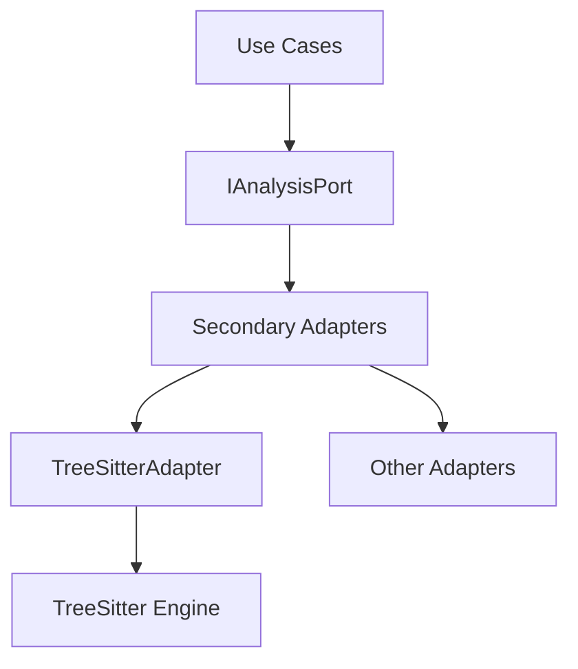

# Analysis Service

## Overview
The Analysis Service provides a secondary adapter for integrating TreeSitter-based project analysis into the Hex architecture. This component was motivated by ADR-0001, which identified the need for a standardized interface to support multiple analysis engines while maintaining separation of concerns. It spans the ports and adapters layers, enabling usecases like project analysis to depend on a contract rather than implementation details. The service implements the `IAnalysisPort` contract defined in `ports/IAnalysisPort.ts`.

## Architecture


The Analysis Service follows Hexagonal Architecture principles:
- **Ports**: Defined in `ports/IAnalysisPort.ts` (contract for analysis operations)
- **Adapters**: Secondary adapters like `TreeSitterAdapter` implement the port contract
- **Use Cases**: Consumers like `AnalyzeProject` depend on the port interface

## Quick Start

### Prerequisites
- Node.js 18+
- TypeScript 5.2+
- Environment variables:
  - `API_KEY` (for TreeSitter API access)

### Installation
```bash
npm install
```

### Development Mode
```bash
npm run dev
```

### Production Build
```bash
npm run build
```

### Testing
```bash
npm test
```

### Architecture Validation
```bash
npm run hex analyze
```

## API Reference

### `ports/IAnalysisPort.ts`
#### `analyzeProject(projectInput: ProjectInput): Promise<AnalysisResult>`
Performs analysis on a project using the configured analysis engine.

**Parameters:**
- `projectInput: ProjectInput` - Object containing project configuration

**Returns:**
- `Promise<AnalysisResult>` - Analysis results object

**Example Usage:**
```typescript
import { IAnalysisPort } from '@hex/analysis/ports/IAnalysisPort';

const analysisService: IAnalysisPort = ...;

const projectInput = {
  path: '/path/to/project',
  language: 'typescript',
  options: { maxDepth: 5 }
};

const analysis = await analysisService.analyzeProject(projectInput);
console.log(analysis.issues);
```

## Development Guide

### Adding New Adapters
1. Create new implementation in `adapters/secondary/`
2. Implement the `IAnalysisPort` contract
3. Register adapter in `adapters/secondary/index.ts`

### Testing Conventions
- Use London School testing (test behavior, not implementation)
- Mock dependencies using Jest's `jest.mock()`
- Test boundaries using `hex analyze`

### Common Pitfalls
- Avoid violating port boundaries by not importing adapters directly
- Ensure all dependencies flow inward toward the core
- Maintain consistent error handling across adapters

### Architecture Validation
Run `npm run hex analyze` to validate your implementation against the port contracts and ensure proper dependency direction.

## Related
- [ADR-0001: Analysis Service Design](docs/adrs/adr-0001-analysis-service.md)
- [IAnalysisPort Interface](ports/IAnalysisPort.ts)
- [TreeSitterAdapter Implementation](adapters/secondary/TreeSitterAdapter.ts)
- [AnalyzeProject Use Case](usecases/AnalyzeProject.ts)