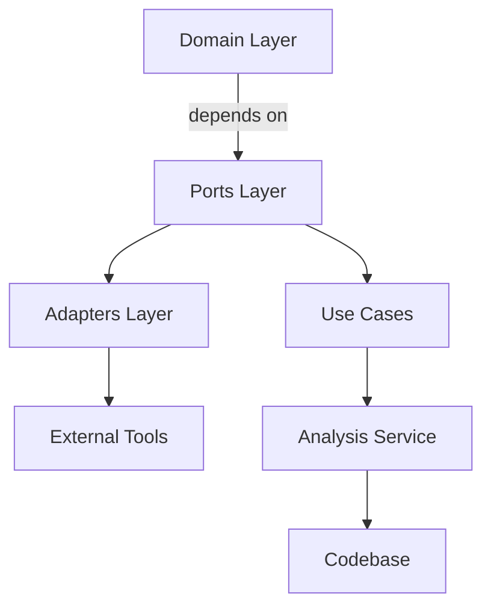

# Project Hex Analysis Adapter

## Overview
This component provides a unified interface for integrating various code analysis tools into the Hex architecture. It was motivated by ADR-001 to decouple analysis logic from the core system, enabling pluggable third-party tools while maintaining strict hex boundaries. This port/adapter layer sits between the domain layer and external analysis services, allowing the system to remain agnostic to the specific analysis engine used. The component spans the ports and adapters layers of the hex architecture.

## Architecture


The `ports/IAnalysisPort.ts` interface defines the contract for analysis tools. Adapters like `TreeSitterAdapter` implement this interface to provide specific analysis capabilities. Use cases in the domain layer depend on the analysis port interface, ensuring no direct coupling to implementation details.

## Quick Start

### Prerequisites
- Node.js 18+
- TypeScript 5.2+
- Yarn or npm

### Installation
```bash
git clone https://github.com/your-org/project-hex
cd project-hex
yarn install
```

### Development Mode
```bash
yarn dev
```

### Production Build
```bash
yarn build
```

### Testing
```bash
yarn test
```

### Running Architecture Validation
```bash
yarn hex analyze
```

## API Reference

### `ports/IAnalysisPort.ts`
```typescript
export interface IAnalysisPort {
  /**
   * Analyze a project file and return analysis results
   * 
   * @param filePath - Path to the file to analyze
   * @returns Promise<AnalysisResult>
   */
  analyze(filePath: string): Promise<AnalysisResult>;

  /**
   * Get dependencies for a specific file
   * 
   * @param filePath - Path to the file
   * @returns Promise<DependencyMap>
   */
  getDependencies(filePath: string): Promise<DependencyMap>;

  /**
   * Get code structure for a file
   * 
   * @param filePath - Path to the file
   * @returns Promise<CodeStructure>
   */
  getCodeStructure(filePath: string): Promise<CodeStructure>;
}
```

### Usage Example
```typescript
import { IAnalysisPort } from '@your-org/project-hex/ports/IAnalysisPort';

class AnalysisService {
  constructor(private analysisAdapter: IAnalysisPort) {}

  async analyzeProject(filePath: string): Promise<AnalysisResult> {
    const result = await this.analysisAdapter.analyze(filePath);
    return result;
  }
}
```

## Development Guide

### Adding New Adapters
1. Create a new adapter in `adapters/secondary/` directory
2. Implement the `IAnalysisPort` interface
3. Register the adapter in `adapters/index.ts`
4. Add to `package.json` scripts for testing

### Testing Conventions
- Use London School testing (test behavior, not implementation)
- Mock dependencies using Jest's `jest.mock()`
- Test adapters in isolation with `jest.mock()` and `jest.requireActual()`

### Common Pitfalls
- Avoid importing domain layer code in adapters
- Ensure all dependencies are injected via constructor
- Maintain strict type definitions in port interfaces

### Architecture Validation
Run `yarn hex analyze` to validate port/adapter boundaries and dependency directions. This tool checks:
- All ports are implemented
- Adapters implement ports correctly
- No circular dependencies
- Correct dependency directions

## Related
- [ADR-001: Hex Architecture Implementation](docs/adrs/adr-001.md)
- [ports/IAnalysisPort.ts](src/ports/IAnalysisPort.ts)
- [adapters/secondary/TreeSitterAdapter.ts](src/adapters/secondary/TreeSitterAdapter.ts)
- [Workplan: Analysis Tool Integration](docs/workplans/workplan-analysis-tools.md)