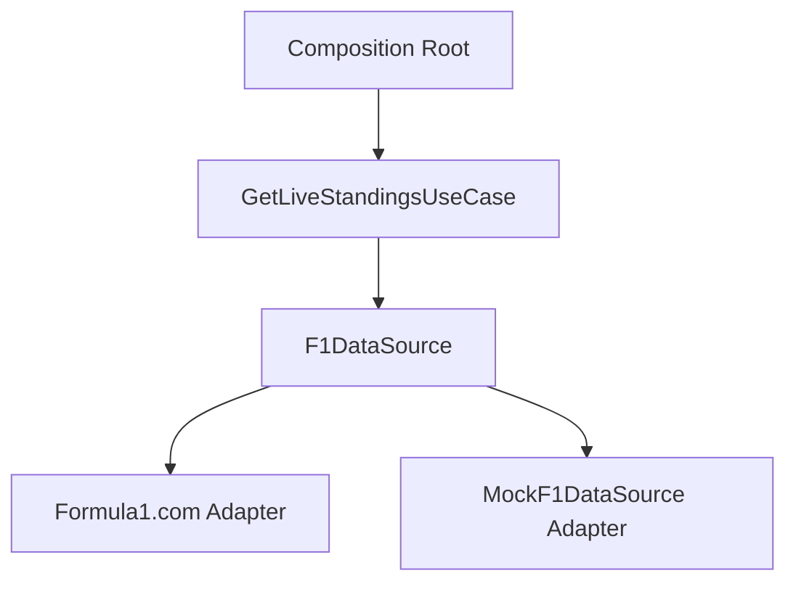

# ADR-230817142000: F1 Web App Data Layer Adapters

## Status
proposed

## Date
2023-08-17

## Drivers
- Real-time F1 data from multiple external APIs (Formula1.com, Ergast, etc.)
- Need for testability via mock adapters
- Maintain hexagonal architecture boundaries
- Support for historical data queries

## Context
The application requires fetching live race standings, historical season data, and constructor tables from external F1 APIs. These APIs have different data schemas and rate limits. We must:
1. Abstract external API details behind consistent interfaces
2. Support both live data (real-time updates) and historical data (batch processing)
3. Maintain testability without real API dependencies
4. Preserve hexagonal architecture boundaries where domain models must not depend on external services

Existing ADR-001 establishes hexagonal architecture as the foundational pattern. ADR-014 mandates dependency injection for test isolation. ADR-015 specifies SQLite for state persistence.

## Decision
We will implement a layered data access system with:
1. **Domain Layer**: Define `F1DataSource` port interface with methods like `getLiveStandings()`, `getHistoricalResults(round: number)`
2. **Adapters Layer**: Create primary adapters for each external API (Formula1.com, Ergast) and secondary adapters for testing (MockF1DataSource)
3. **Composition Root**: Wire adapters to ports using dependency injection
4. **Use Cases**: Encapsulate data fetching logic in use cases (e.g., `GetLiveStandingsUseCase`) that depend on the `F1DataSource` port

## Consequences

### Positive
- Decouples domain logic from external API details
- Enables easy switching between API providers
- Allows unit testing without real API calls
- Maintains clean architecture boundaries

### Negative
- Additional complexity in adapter implementation
- Potential performance overhead from adapter layer
- Requires careful versioning of external API contracts

### Neutral
- No immediate impact on existing domain models
- No data migration requirements
- No backward compatibility concerns

## Implementation

### Phases
1. **Phase 1 (Domain & Ports)**: Define `F1DataSource` interface and domain models (completed)
2. **Phase 2 (Adapters)**: Implement primary adapters for Formula1.com and Ergast APIs
3. **Phase 3 (Use Cases)**: Create use cases that orchestrate data fetching
4. **Phase 4 (Composition Root)**: Integrate adapters with dependency injection

### Affected Layers
- [ ] domain/
- [ ] ports/
- [ ] adapters/primary/
- [ ] adapters/secondary/
- [ ] usecases/
- [ ] composition-root

### Migration Notes
None - adapters will be implemented as new layers without affecting existing code.